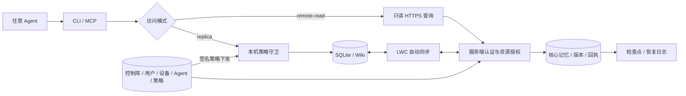
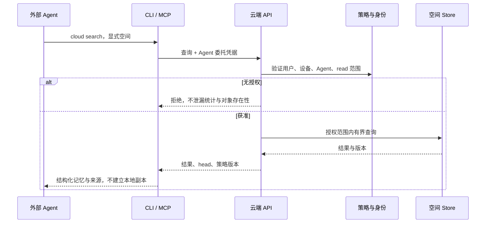
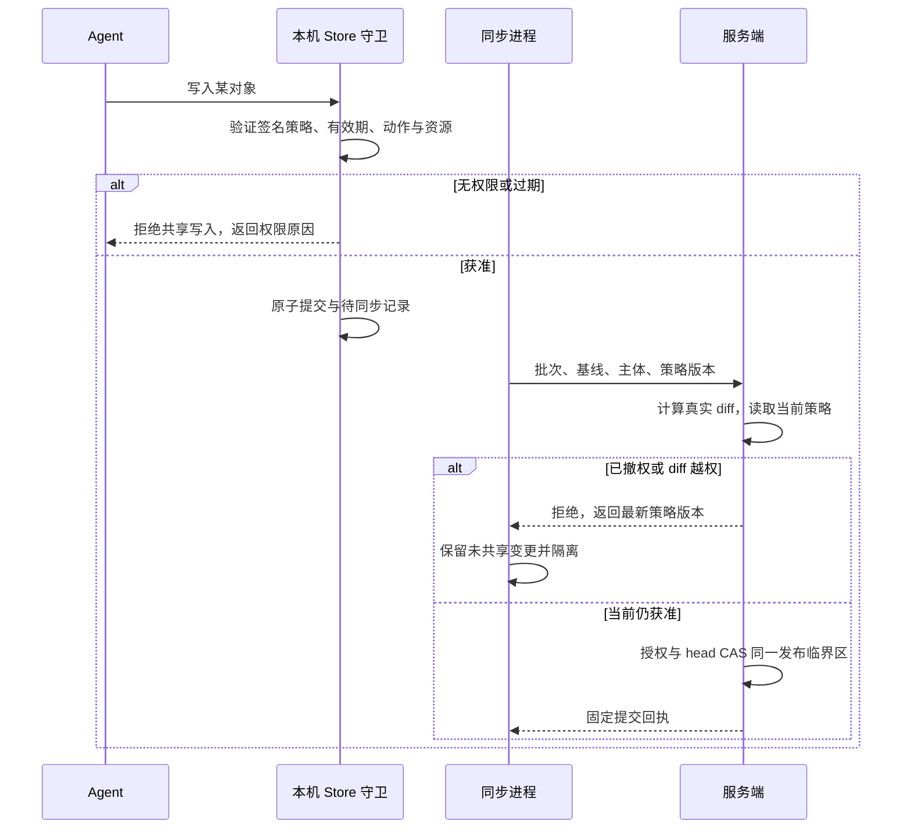
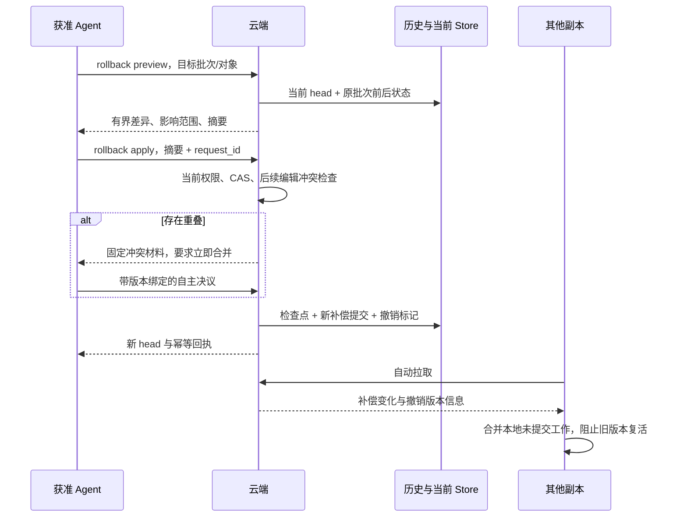

# 团队访问、Agent 身份、权限下发与恢复

状态：设计 v6 增补，2026-09-28；用户要求已纳入交付范围，以下协议细节为工程方案，不代表已经实现。执行状态以原 LWC Plan 为准。本文替换旧设计中“不含页面级权限”、无限期离线写入及仅支持本地副本的假设。

## 1. 两种访问方式

| 模式 | 本机保存 | 用途 | 约束 |
|---|---|---|---|
| `replica` | 完整空间 SQLite、Wiki、基线、未提交变化 | 长期工作的 Agent，离线读取及获准写入 | LWC 自动同步，写操作受本机策略与服务端双重校验 |
| `remote-read` | 账号凭据、设备登记；默认不保存记忆正文 | 临时 Agent、仅检索云记忆 | 不创建记忆库、Wiki、副本、outbox 或同步进程；仅在线读取 |

拟定 CLI 为 `lwc cloud search/get/history --server ... --space ...`，MCP 为结构化 `lwc_cloud` 只读工具。这些是目标合同，尚不能作为已发布命令使用。复用云端 Store 查询与领域校验，不开放任意 SQL、路径或任意命令执行。远程模式不能失败后悄悄建立本地副本，也不能接受写入动作。

查询覆盖全部获准核心记忆，返回空间、对象 ID、来源、版本、服务端 head、policy revision 和分页游标。授权过滤发生在搜索、统计、关系展开和分页之前；游标绑定查询、主体、策略与 head，策略变化重新验证。正文只在进程内短暂存在，日志不记录正文。Agent 宿主收到结果后如何保存，属于宿主边界，不能宣称端到端“绝不落盘”。

## 2. 用户、设备与 Agent 分开建模

归属链是 `服务实例 → user_id → device_id → agent_id → run_id`。团队成员资格、空间授权挂在服务端验证的 user_id 上；同一用户可以拥有多个设备和 Agent。同一设备支持多个 Agent，run_id 只用于审计关联，不是权限来源。

`lwc config` 新增按服务实例隔离的 team account 配置：email、nickname、device_label、默认访问模式。配置保存在用户级私有目录，项目配置只引用 account ID，不把个人资料和凭据提交 Git。邮箱是登录提示或已验证资料；修改邮箱必须重新验证/显式绑定身份，不能通过填管理员邮箱变成管理员。昵称可以更新，但审计始终用不可变 user_id。

首次认证登记时生成随机 device_id 和设备密钥，采集 OS、架构、LWC 版本和设备名称。按用户要求采集一次网络接口信息，默认只上传安装级加盐摘要并丢弃原始 MAC，不记录网络地址/位置；缺少可用接口也允许登记。后续不每次扫描，显式重新登记才更新。MAC 会随机化，不能拿它认证用户或唯一识别机器；例如 Apple 的私有 Wi-Fi 地址机制会改变地址。[Apple 官方说明](https://support.apple.com/en-us/102509)

Agent 注册记录 owner、device、宿主/名称、允许动作与空间。凭据由已认证用户获得并收窄委托范围，服务端从凭据解析归属，不相信请求自填 user_id。Agent 品牌/宿主名称是声明元数据，不声称能证明其模型供应商。设备私钥按 OS 用户保护；采用成熟实现绑定令牌与设备密钥，可参考 [OAuth DPoP RFC 9449](https://www.rfc-editor.org/rfc/rfc9449.html)，不自行发明密码协议。

**同一 OS 用户下能读取所有凭据的进程可以冒用另一个 Agent。** 严格的不同 Agent 隔离需要独立凭据及 OS 用户/沙箱；单靠昵称或 MAC 无法做到。撤销设备或 Agent 会终止它的云端能力，不能抹除已经读到的内容。

## 3. 资源与动作授权

现有 viewer/editor/manager 继续作为默认权限模板，增加资源规则，不另引入完整通用策略语言。规则作用于空间、对象类型或对象 ID；显式 deny 优先，无授权默认拒绝。有效权限为用户授权、Agent 委托范围和设备限制的交集。每次请求校验，符合 [OWASP 授权指南](https://cheatsheetseries.owasp.org/cheatsheets/Authorization_Cheat_Sheet.html)。

| 动作 | 约束 |
|---|---|
| `memory.read` | 检索、正文、历史及引用闭包均需要 |
| `memory.create / update / delete` | 针对真实新增、修改、墓碑对象逐项校验 |
| `memory.compact` | 内容精简、聚合及 supersedes 操作；保留原始来源和版本 |
| `memory.export / import` | 归档导出、导入；导入还检查每个对象的具体变化权限 |
| `conflict.resolve` | 允许提交决议；还必须具备决议影响对象的写权限 |
| `memory.rollback` | 允许补偿恢复；还必须具备所有受影响对象的权限 |
| `policy.manage` | 管理授权；不能由同步内容、冲突决议或记忆恢复获得 |

现有 `lwc compress` 是归档导出，对应 export；SQLite 物理整理只是本机维护。两者不能与“精简记忆内容”共用一个权限。禁用 export 只约束 LWC 导出入口，不能阻止已获正文的用户自行复制。

禁止 compact 必须同时保护原始记忆、来源链和删除/supersedes 操作。服务端从规范化前后状态计算真实 diff，不能信任客户端填写的 action。即使通过 changeset、导入、直接改 SQLite 或伪造 update 提交，也走同一校验。**允许任意改写正文时，程序不能可靠辨别一次普通编辑是否在语义上做了压缩。** 因此受保护的原始记录不可覆盖，仅允许派生摘要；整理/替代受保护记录必须走 compact 授权。对自由可编辑正文不承诺识别所有压缩意图。

完整副本要求对整个空间具备读取权限；空间内可以逐对象限制写入。如果需要某些正文也不可读，应拆分空间，或用 remote-read 过滤查询。首版不把不完整的过滤快照交给全量替换同步器，避免“没权限看到”被误当成删除。未来只有实现独立 filtered-view 基线协议后才支持部分读取副本。

## 4. 策略下发与本机强制

服务端签名策略包含 subject/user/device/agent、server/space、policy_epoch、revision、规则摘要、签发与过期时间。本机只能缓存，不能修改授权。密钥通过已认证的 HTTPS 注册通道建立信任并固定；轮换要有连续验证，不能信任与数据一起传来的任意公钥。签名使用成熟库。

在共享 Store 的写事务入口检查权限，覆盖 CLI、MCP、changeset、导入、合并、恢复和自动保留策略；先验证整个批次，失败不产生部分写入。后台发布路径使用单独、已验证的远程提交上下文，不能靠跳过标志变成通用越权入口。共享 Wiki 文件的外部修改视为不可信输入，重新导入也必须过权限检查。

策略独立于记忆同步，优先刷新，后台通知/轮询与下一次命令兜底。拟定离线写许可默认 15 分钟，服务端可调整；有效签名策略和允许的动作才可离线写共享库。过期或无法可靠判断时间时拒绝共享写入，可保留明确标记的私人草稿，不能自动发布。对已经得知的撤权立即停止共享写入。

离线设备无法即时知道撤权，因此不能同时承诺“无限离线可写”和“撤权瞬间本机生效”。服务端始终用当前策略在最终提交时复核；断网期间旧授权产生的修改被拒绝时保留隔离副本，不丢弃、不换身份重试绕过。

## 5. 双向防污染

复用已有传输摘要、规范化校验、staging、CAS、checkpoint 和幂等回执。新增签名 manifest/提交回执，将 server、epoch、head、父版本、批次、内容摘要与主体绑定；TLS 保护传输，签名验证内容来源，摘要本身不等于身份认证。

上传：用户/设备/Agent 验证 → 流量与大小限额 → 沙箱 staging → schema/引用/历史不可变性校验 → 从真实 diff 检查当前权限 → CAS 发布。混有越权对象的批次整体拒绝，合法本地工作保留供重新组批。

下载：验证信任链、epoch/head 连续性和摘要 → staging 解析及领域校验 → 合并保留本地 outbox → 写入前检查点 → 事务发布 → Wiki/FTS 重建。验证失败隔离包并保留旧库，不把未验证内容送给 Agent 当可信工具指令。记忆正文一直是数据，不具有提升权限、运行命令或更改 Agent 指令的效力。

签名不能证明内容事实正确，也不能防住持有合法写权限的人提交语义错误。确定性异常自动隔离；无法确定的语义分歧保留来源，投递给获准 Agent 处理。没有在线 Agent 时保持待处理并继续不相关同步；LWC 不调用 LLM。

## 6. 回滚不是把共享 head 调回过去

正常恢复追加补偿提交，新 head 单调增长；历史与原批次留存。复用提交日志和快照，不重写所有领域为 Event Sourcing。补偿事件而非删除历史的原则可参照 [Microsoft Event Sourcing 指南](https://learn.microsoft.com/en-us/azure/architecture/patterns/event-sourcing)。

| 场景 | 恢复方式 |
|---|---|
| 本机库/投影损坏 | 隔离损坏副本，恢复最后已验证检查点，重新应用合法 outbox；不自动要求全团队回退 |
| 云端接受了错误批次 | 根据目标批次生成逆向变化，创建新的共享补偿提交 |
| 个别对象遭污染 | 按对象和版本恢复，保留其他对象及后续无关变化 |
| 整空间需回退 | 预览完整差异并验证全部权限；有后来变化的对象进入合并，不能盲目覆盖 |
| 服务端灾难备份恢复 | 新 epoch，重新验证策略与凭据状态，保留客户端未确认变化并 reconcile |

目标接口为 `history / rollback preview / rollback apply` 的 CLI/MCP 等价能力。preview 固定目标版本、当前 head、影响对象、diff 摘要与有效期；apply 使用同一摘要、CAS 和幂等 request_id。预览与提交是机器可连续执行的两个步骤，不要求人工逐次批准；Agent 只能在其既有授权内自主执行。

只对仍匹配错误批次 post-image 的字段/对象直接应用逆变更；后来的无关编辑保留，有语义重叠则产生冲突交给 Agent。共享 rollback 和对应对象写入均须获准，不能借恢复重放旧 ACL、会话或密钥。控制面恢复有单独运维路径，不跟记忆回滚混在一起。

补偿记录保存撤销批次和受影响对象版本 lineage。旧离线副本携带已撤销版本时不能将其自动“复活”；相同受撤销因果版本隔离，独立新修改对新基线 rebase。获准的刻意重新引入也必须形成新的可审计提交，不复用旧 receipt。原空间单独保存撤销标记，不能随正文保留期清理。

快照/正文恢复期默认 30 天、可配置；超过期限明确返回不可恢复，不假装全部历史永久可回退。未 ACK、冲突引用、待提交变化不按时间清理。不可变摘要/墓碑/撤销标记长期保留；配额不足停止接受新写并明确报告。独立备份与凭据隔离保护事故恢复；同一管理员控制数据库、签名密钥和全部备份时，应用内哈希链不能抵御该管理员全面篡改。

## 7. 实施顺序和最小验收

保持原计划稳定步骤 ID；已完成的登录/RBAC基础不改写成新授权功能已经完成。

1. **当前 P3/P4**：统一 target（replica/remote-read），用户资料与设备/Agent登记、委托凭据；资源动作规则、签名策略、Store 守卫、服务端真实 diff 校验。先保护边界，再扩大写入口。
2. **P5**：CLI/MCP 权限对等，冲突决议不扩权；恢复 preview/apply、补偿提交、撤销 lineage、受权限约束的 Agent 自动恢复。
3. **P6**：策略优先下发、租约过期、撤权隔离；下载验证与恢复检查点接入自动同步，无权限不能反复上传污染包。
4. **P7**：管理端增加设备/Agent、有效权限矩阵、版本差异与恢复记录、隔离状态；部署补充签名密钥和备份恢复指引。
5. **P8/P9**：仅扩展下列有区分度的回归与必要发布门禁，不重跑无关全仓测试。Rust 编译与测试全部在 Pro。

| 验收 | 必须观察的结果 |
|---|---|
| 无本地库的云查询，CLI/MCP 各一次 | 正确结果；无 wiki.db、Wiki、outbox、副本登记和后台同步；越权搜索及统计不泄漏 |
| 伪造 email/nickname/agent_name/device_id | 不能改变服务端已认证主体或提升委托权限 |
| A 不可编辑目标对象 | 正常 CLI/MCP 本机拒绝；直接改库、导入或伪造 action 提交也被云端拒绝，无部分发布 |
| B 不可 compact | 保护原始记忆/历史；通过 update/delete/supersedes 换入口仍不可绕过；归档导出独立校验 |
| 离线策略过期、在线撤权与并发提交 | 本机按租约拒绝；云端当前策略最终裁决；未共享变化保留 |
| 篡改上传/下载、重放旧 head/旧策略 | live 数据不被替换；材料隔离、返回有界诊断 |
| 补偿恢复 + 丢响应 + 后续编辑 + 旧副本上线 | 一次新提交；不回退 head、不覆盖无关变化、不复活被撤销版本 |
| 本机损坏或备份恢复新 epoch | outbox 保全、策略不能回退、与新 head 正确 reconcile |

这些是新增交付门禁，不是现有测试通过的声明。时间目标需按扩展范围重新评估，不能通过削去权限/恢复门禁宣称提前完成。
