# LWC 团队与云端记忆：本地优先设计

状态：设计 v6，按用户复审要求覆盖全部核心持久记忆，并把冲突提醒与Agent立即处理列为强制合同；管理端采用React + shadcn/ui。基础实现进行中；新增访问、细粒度授权与恢复合同尚待实现。日期：2026-09-28。源码基线：`7e065db` / `v0.18.6`。

图示约定：架构、领域、交互时序与状态图使用Mermaid；管理端UI原型按用户新要求使用ASCII。

配套文档：[一天编码与交付计划](implementation-plan.md)、[管理端UI与ASCII原型](admin-ui.md)、[腾讯项目参考评估](reference-tencent.md)、[同步算法与工程评审](sync-engineering.md)。执行状态由LWC Plan `84715af7b63db12278d87a62cf00f13c`管理。需求与修正已保存于项目 Discussion `team-cloud-design-20260928`；本文是设计与决策，不是原始对话副本。

新增合同：[双模式访问、身份、权限下发与恢复](access-policy-recovery.md)。其资源动作权限、离线许可及补偿恢复规则优先于本文旧角色模板；完整副本与只读云访问同时交付。

## 1. 设计结论与首版范围

**记忆先写入本地 SQLite 和 Wiki，本地与云端自动双向同步；其他成员拉取到自己的本地库，在本地使用、编辑和合并。** 云端是带权限的团队交换中心、版本保管与分发节点，本地不是云端查询缓存。离线读取仍可用；共享写入必须满足有效的缓存授权，过期后停止共享写入并保全私人草稿。另支持不建立本地副本的云端只读调用。

**产品原则：LWC为任意Agent提供环境、数据和工具；Agent通过CLI/MCP使用LWC。LWC不内嵌Agent、不接LLM API、不启动或托管Agent进程。可确定的同步、合并、校验和恢复由程序自主完成；需要判断的语义工作由外部Agent自主完成。**

已确认：自建团队版、不含计费；邮箱验证码、飞书、GitHub 三种登录；部署者填写接入配置；全部核心持久记忆参与同步，包括Wiki、SQLite中的领域记录、时序事件、Discussion、Todo、Plan及其历史、证据、关系和反馈；空间显式授权、默认不可读；LWC自主准实时同步且参数可调；冲突通过Hook或下一次CLI/MCP响应隐式提醒，Agent观察到后立即优先处理合并，不要求人类逐次确认。

最新要求替换此前“共享记忆在线读写”的初步选择。首版必须有完整本地副本、后台同步与 Agent 合并，不能把它们放进后续版本。

首版不包含计费、SaaS运营、扩展插件专有存储复制、云端CodeGraph服务、聊天代理、通讯录同步、多副本服务高可用、远程Agent任务执行器。个人云空间与团队空间共用完整核心记忆复制机制；现有未绑定的个人global保持私有。选择同步范围按库/空间进行，不能再以“仅知识页或Todo/Plan”的类型开关漏掉该范围内其他核心记忆。

默认工程边界：单个Linux服务实例、本地持久磁盘、Docker Compose；CLI面向已有六个平台；试用规模按50人/100空间/每空间1万知识页设计，**这是规划输入，不是已验证容量**。先复用现有Sync实现，不先引入CRDT、消息队列、向量数据库或新的存储后端。

一天交付指设计冻结后的24小时实施目标。新要求增加了自动同步和无人值守语义合并，不能再沿用在线CRUD版本的工作量估算。计划保留集成、故障恢复和发布时间，安全/数据一致性门禁未通过时如实报告，不以“时间到了”判定完成。

## 2. 当前实现：可以复用什么

| 源码 | 当前可复用事实 | 需要补齐 |
|---|---|---|
| `src/scope.rs` | 本地project/global解析与目录保护 | 独立的空间本地副本定位与项目绑定；不改变旧all范围 |
| `src/store/sync.rs::export_sync_state` | 已导出Wiki/来源/标签/关系、导入分析、检索反馈、时序记忆、Todo、Plan、Discussion | 全部核心语义覆盖清单；补来源路径版本链和必要变更历史；隔离运行状态与插件存储 |
| `prepare_sync_transfer` / `apply_sync_transfer_artifact` | 摘要校验、已确认基线、full/delta传输 | HTTPS空间协议与客户端身份 |
| `merge_sync_states_directional` | 双端基线与对象级三方合并 | 多成员以hub为对端；自动调度循环 |
| `resolve_sync_conflicts` | conflict_id校验、结构化决议、preserve_both | 通用冲突发现/读取/提交工具，支持外部Agent提交新合并正文 |
| `src/store/sync_publish.rs` | CAS、事务发布、回执、派生重建恢复 | 云端head/批次审计同事务；客户端自动恢复 |
| `src/store/todo.rs`、`plan.rs` | 状态机、版本校验、历史 | 副本间语义合并与本地执行上下文分离 |
| `src/agent/signals.rs` | 有优先级100的SSH Sync恢复信号及上下文边界 | 独立的云副本冲突信号、优先投递和通用CLI/MCP响应兜底；不传播他人执行授权 |
| `src/main.rs` | 模块直接进入主程序，暂无独立lib | 新增lwc server子命令，保留现有serve --mcp，首版不全面拆crate |
| `src/view/mod.rs` | loopback只读Viewer | 新增认证管理界面，原Viewer继续本地工作 |

既有SSH Sync是带Git协调的显式会话流程，不直接循环调用 `lwc sync HOST` 当作云端同步器。复用Store层的导出、delta、合并、验证、发布与回执，HTTPS调度单独实现；云记忆同步不自动执行git pull/push。

当前规范化合并会加载对象集合，导出会产生快照；它不是已经具备常量开销的逐行实时复制。第一版按变更触发、合并窗口、摘要去重与并发上限控制成本，容量测试超出边界后再做对象日志优化。

## 3. 总体架构与信任边界

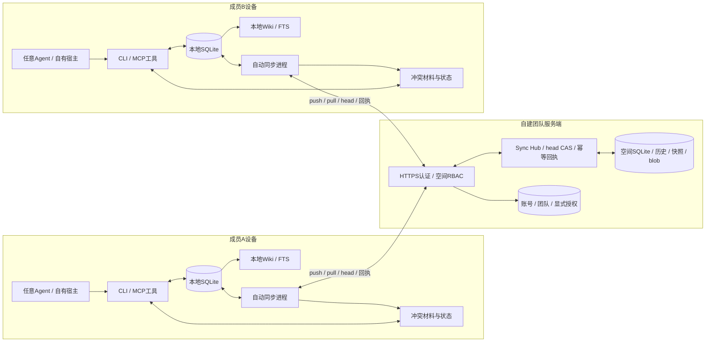

图中A/B各自的SQLite与同步进程双向交换状态；Wiki/FTS由本地SQLite派生。图中Agent由使用者自己的宿主运行，LWC只响应工具调用；同步守护进程不反向调用Agent或LLM。

本地Store是本机工作的权威状态；云端head是**团队已经接受的共同版本**。本地未同步变更是正常状态，不因云端head存在就被覆盖。服务器以CAS顺序接受共享提交，不代替Agent生成记忆。

云端保存规范化历史与一个可查询的空间Store；本地保留独立Store、投影、同步基线、待提交批次和冲突材料。SQLite通过领域记录复制，在两端各自落为完整本地数据库；不逐字节搬运活跃数据库、WAL/SHM或锁。记忆中的语义上下文照常同步，宿主会话绑定不复制。

## 4. 领域模型与本地存储

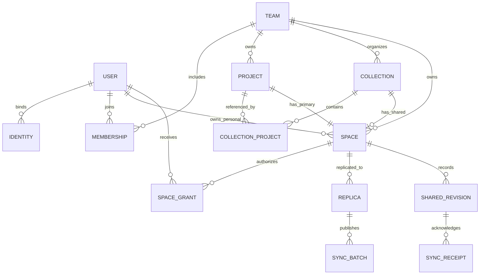

集合与项目通过关联记录形成多对多关系；空间所有者为团队或个人，两者互斥。

集合只是组织多个同团队项目及公共空间，不搬迁数据、不授予权限。一个项目可属于多个集合；一个项目首版一个主空间。空间是授权和复制单位；不做只授权几页但仍下发整库的伪隔离。

空间类型为team-owned或user-owned，互斥。个人云空间只允许本人设备加入；分享通过显式选择内容发布到团队空间。跨团队集合引用拒绝。

### 4.1 本地布局与使用方式

```text
<project>/.lwc/wiki.db                       原有本地项目记忆，保持独立
<project>/.lwc/replicas/<server-id>/<space-id>/
  wiki.db                                  该共享空间的本地权威副本
  wiki/                                    Markdown投影
  sync/
    state.json                             仅通过LWC审计命令更新
    baselines/local.db + remote.db         最后双端确认的基线
    sessions/<batch-id>/                   快照、决议、发布恢复材料
```

每个空间独立本地库，避免不同所有者或团队的内容串库。用户显式加入并绑定同步空间后，日常page/source、memory、Discussion、Todo、Plan等核心命令直接操作该本地Store，在有效缓存授权内离线工作；同一空间内的全部核心记忆自动同步。项目可设置默认空间，目标显示在命令回执与Agent上下文中，不能出现Wiki写共享副本、时序记忆却悄悄写回未同步库的分流。

旧 `--scope project/global/all` 无绑定时保持原行为。设置默认空间需要用户/Agent在明确授权任务中执行一次；之后不为每次同步索要批准。尚未加入的空间不自动下载，加入集合只发现可授权空间，不默认订阅所有项目。

将已有本地项目加入同步：预览核心记忆各类数量、引用闭包及目标空间，默认完整导入该库的核心持久记忆，保留原库以便恢复。发布到团队空间与本人云空间是不同的授权范围，不能把未选择的其他项目或个人global顺带公开。单独选几页是“发布选定内容”功能，不得冒充完整项目同步；本次首版以完整范围同步验收。

SQLite是结构化权威，Wiki是可再生成的本地投影。Agent照常用LWC编辑；直接编辑投影Markdown不自动当作提交，需经现有受审计导入路径，避免文件监听形成SQLite与Markdown相互回写环。

### 4.2 复制对象与排除项

**范围合同：被绑定库/空间中的核心持久记忆必须全部同步；扩展插件专有数据不纳入核心复制协议。** “SQLite记忆”是存储在SQLite中的全部核心领域内容，不是只复制pages表，也不是上传正在使用的数据库文件。核心类型注册表用于验证完整性，不是任意缩小需求的白名单。

| 核心记忆 | 必须同步的内容 | 当前源码与补齐点 |
|---|---|---|
| Wiki与来源 | 页面、摘要、正文、来源blob、来源归属/引用、标签、链接、语义关系与证据 | `export_sync_pages/sources/tags/relations`已有；在接收端重建Markdown |
| 时序记忆 | 事件ID/类型、语义context、发生/记录/有效时间、片段、变化、证据、事件关系、pin、反馈 | `export_sync_memory`已有；覆盖`memory_events/fragments/changes/evidence/relations/feedback` |
| Discussion | 问题、选项、原始可见回答、总结、引用、确认/撤回、修订历史和状态 | `export_sync_discussions`已有；保留领域内容，不带宿主绑定 |
| Todo与Plan | 任务、约束、步骤、状态、结果、证据、标签、依赖及已有历史 | 复用现有导出；历史事件标识需稳定，不能用本机自增ID跨设备定位 |
| 导入与检索记忆 | 来源分析、无派生页理由、领域处理结果、检索权重、反馈及理由 | `export_sync_ingest/retrieval`已有；活动执行权、重试计数留本机 |
| 来源版本与核心变更历史 | `source_path_revisions`中的版本链；核心记忆创建/修改/归档/删除的既有语义证据 | 当前对象导出未覆盖来源路径版本表和operations；新增稳定来源定位及语义历史投影，不复制原始SQL或执行日志 |
| 复制所需历史 | 领域归档、删除意图、冲突候选、合并决议与来源 | 增加tombstone与决议记录；任何未同步内容不得因缓存清理丢失 |

所有新增的核心持久语义字段/表都必须在这张覆盖清单有归属；一个针对性覆盖检查要求其为“已复制”“可从已复制数据重建”“纯本机运行状态”或“插件专有存储”，并记录理由。未知核心类型/协议版本显式失败并保留待同步数据，禁止以忽略未知类型获得假成功。为每种复制类型验收本地→云→新空白本地的语义等价，而非比较物理SQLite字节。

重建项：Wiki Markdown、FTS、search spans、物理图索引及统计缓存。同步其权威内容后在每端生成；手写但尚未导入的Wiki文件要在首次接入检查中显式报出并走受审计导入，不能默默遗漏。托管投影仍不支持绕过Store直接编辑后偷偷上传。

纯本机运行状态：登录凭据、会话与配置、Plan/Todo tracks、Discussion bindings、Hook去重状态、活跃Work/changeset的执行句柄与锁、进程/宿主路径映射、网络重试和缓存。Work/changeset已提交到核心Store的记忆结果与领域变更证据照常同步；复制历史不重放外部动作。来源的原始定位信息保留为不可执行的provenance，跨机路径使用稳定逻辑标识，本机访问路径另外映射。不要因为字段叫`context`就删掉时序记忆的语义context；Discussion的宿主context按现有导出逻辑移除，新机导入不自动绑定/续跑。

插件专有数据：Book/Tutor/Practice等扩展运行时拥有的会话库、练习状态和插件缓存不复制；由插件通过正常核心命令正式写入Wiki/source/memory的记录，成为核心记忆后同样同步。按数据所属领域判断，不能只因作者是插件而漏掉合法核心记录。

**过滤运行状态之后不能覆盖整Store并误删本机绑定。** 专用副本发布只替换核心语义投影，保留本地运行状态。sources按content hash映射，不信任本机自增source_id；领域对象保留逻辑ID；同slug创建进入冲突，不用最后写入覆盖。

### 4.2.1 时序保留、历史与同步完整性

现有`temporal_memory.rs::enforce_memory_retention`会按年龄/容量删除事件。团队副本不能直接沿用这一路径：离线尚未ACK的事件、冲突引用和必要证据必须保留；空间使用一致的保留策略。首版完整副本不做设备各自淘汰领域事件，避免“本机清理→云删除→其他成员丢失”以及pull后重复淘汰。

初始默认不自动过期核心记忆；需要领域归档/删除时走显式策略和可复制记录，未ACK内容不清理。`history_retention_days`仅控制复制快照/delta材料，不是删除Wiki、时序事件或Discussion领域历史。磁盘额度达到上限时返回可恢复的容量错误，保留既有内容，不通过静默遗忘腾空间。现有个人未同步库的策略保持兼容。

核心变更历史只投影原始领域事件，稳定事件ID按副本命名空间和源事件确定；导入、投影重建、同步ACK等操作不再次变成新领域事件。保留来源时间但不用跨机墙钟决定覆盖顺序，防止历史自己触发无穷push。

### 4.3 云端控制库与空间库

控制库保存users、identities、verified_emails、sessions、login_challenges、teams、memberships、invitations、projects、collections、collection_projects、spaces、space_grants、replicas及控制面审计。

每空间数据库保存规范化共享状态、可查询Wiki/时序事件/Discussion/Todo/Plan，以及 `shared_head`、`sync_receipts`、`sync_audit`、`sync_tombstones`和冲突材料索引。共享提交、head更新、batch回执和actor审计必须同一数据库事务；快照blob先写临时文件并校验，提交只引用已持久化的文件，启动回收未引用临时文件。

replica_id绑定server、space与注册用户；用户不通过伪造replica_id获得另一用户权限。相同用户多台设备也有不同replica_id，副本注销不删除团队数据。

## 5. 权限规则与离线边界

团队角色owner/member；空间角色viewer/editor/manager。团队owner管理成员与目录，**不直接获得空间正文权限**；空间创建者得到一条显式manager grant。viewer可以拉取，editor可推送，manager再增加授权与归档管理。

| 动作 | 无空间授权的team owner | viewer | editor | manager |
|---|---:|---:|---:|---:|
| 管理团队目录与成员 | 是 | 否 | 否 | 否 |
| 加入副本、pull、读取共享历史 | 否 | 是 | 是 | 是 |
| push合法语义提交、发布Agent合并结果 | 否 | 否 | 是 | 是 |
| 调整grant/归档空间 | 否 | 否 | 否 | 是 |

服务端每次head查询、长轮询、快照/增量/blob下载、提交与回执读取都认证授权。用户身份来自会话；团队成员有效性检查在历史创建者身份之前。集合绑定与Agent读取范围不能扩权。

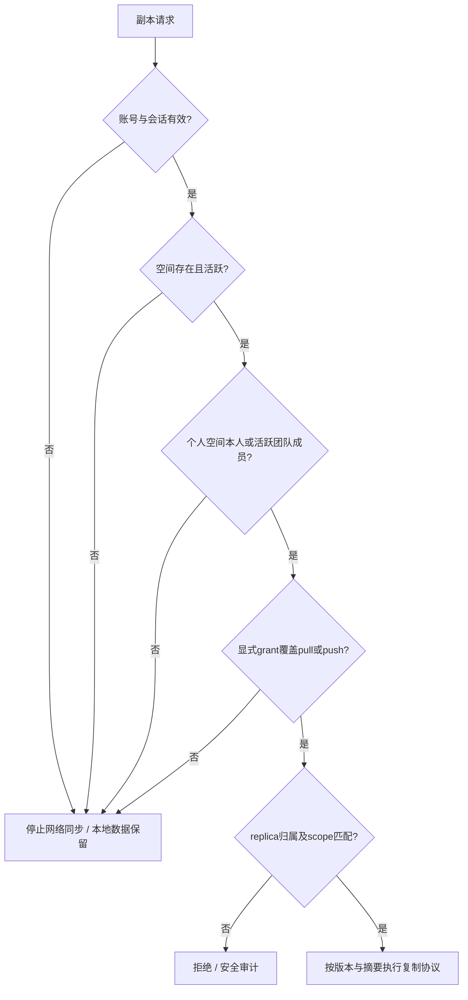

撤权停止此后获准的新云端读取、pull、push、通知和会话使用；**无法收回已下发的本地数据**。本地Wiki和SQLite的完整副本是用户明确选择的产品能力，不宣称“离线副本可即时失效”。客户端可标记revoked并停止同步，不能悄悄抹掉用户已写内容。

离线期间权限变化未知时，仅在签名策略许可有效期内允许获准的本地写入；过期拒绝共享写入。重连若push被拒绝，保留本地工作并自动隔离为未共享变更，不换账号绕过、不自动上传到另一个空间。viewer副本默认阻止对共享目标写入；私人注释放个人空间。

团队owner可看到治理所需空间ID/名称，但未获grant时不能下载正文。普通成员只能看到获准项目详细内容。最后一个manager离开时走有原因的实例运维恢复，不自动让所有管理员读所有空间。实际服务器管理员可读磁盘，这是应用RBAC的边界。

## 6. 三种登录与统一会话

### 6.1 部署与启用规则

三种方式均实现，按部署配置启用；未配置的入口隐藏。设置 enabled=true 却缺少关键配置时服务启动失败并提示缺失的配置名称，不输出配置值。启用至少一种登录方式才能对外服务；不得提供开发万能验证码或默认管理员密码。

实例管理员通过服务器本地 `lwc server bootstrap --email ...` 预置首位管理员的允许邮箱，再由该人正常完成邮箱验证/身份绑定。该命令必须只有持服务器目录权限的人可执行。**禁止“第一个访问者自动成为管理员”。** 邮件未启用的安装可使用 provider+namespace+subject 预置引导身份。

首版邀请制：登录确认身份，邀请或管理员预置决定是否激活本实例账号；成功登录本身不会加入团队或获得空间授权。管理员可以创建多个团队。创建个人云空间不意味着可以访问任一团队。

### 6.2 邮箱验证码

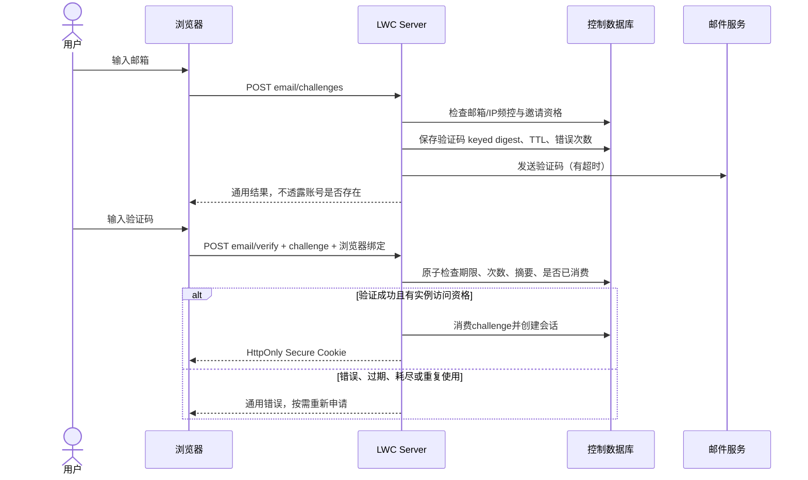

工程默认值：6 位码、5 分钟有效、每 challenge 最多 5 次尝试；同邮箱 60 秒发送间隔、每小时上限，另设 IP 与全局额度。重新发送使旧码失效，但不能重置账号级攻击计数。码与发送内容不进日志；数据库保存 HMAC 等带服务器密钥的摘要，避免仅凭小空间验证码哈希可离线枚举。随机数和 HMAC 使用维护中的密码库，不手写算法。

邮件发送失败只终止/标记该 challenge，不创建会话；不能给全站认证造成长时间阻塞。邮件 API/SMTP 只支持部署者预置地址，用户输入不能决定发信服务器。

### 6.3 飞书 / GitHub

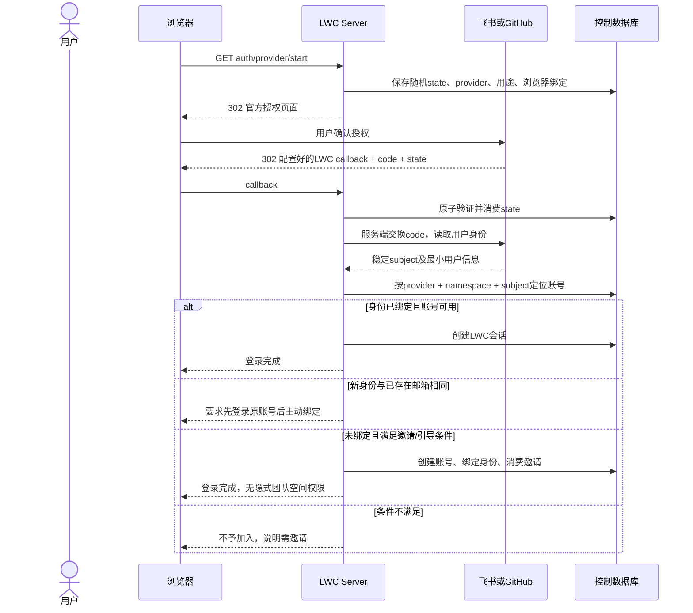

两种 OAuth 共享状态与会话管理，provider-specific 部分限于授权地址、code 交换和身份映射。GitHub 用稳定数字用户 ID；飞书用应用 namespace 与稳定 open_id，需依据部署应用类型核实字段。飞书 tenant 标识不可直接当作 LWC team_id，外部组织不会自动映射权限。

回调地址仅使用部署配置的精确 HTTPS URL；校验 state、发起浏览器和 provider，禁止任意 return_to。GitHub 授权码流程使用 S256 PKCE；飞书是否支持及具体参数需以最终选用的官方接口实测，不宣称两者支持完全相同的协议。OAuth 第三方 token 只在本次身份读取期间使用，首版不申请代码仓库、通讯录或长期离线访问权限，不持久存储不需要的 provider token。

### 6.4 账号绑定与退出

已登录用户发起绑定，需要近期重新认证；challenge 绑定该 LWC user_id。第三方身份已有归属则返回冲突，不自动移动或合并。解除最后一种有效登录方式被拒绝。邮箱变更需旧账号重新认证和新邮箱验证；首版不支持自动合并两套已有数据的账号。

浏览器会话使用 opaque 随机 token，服务端仅存 hash；Cookie 设置 Secure、HttpOnly、SameSite=Lax，状态修改使用 CSRF token 与 Origin 校验。浏览器 token 不进入 localStorage。

CLI token 与浏览器会话分开，记录用途、到期时间和设备标签，可独立撤销。首版到期重新网页登录，不新增 refresh-token 轮换体系。每次访问都检查会话/账号状态，不把角色永久固化进长寿命 JWT。建议浏览器有效期 12 小时、CLI 7 天，均可由部署配置缩短。

### 6.5 CLI / SSH 场景登录

采用 LWC 自己的设备授权流程：CLI 只与 LWC Server 通信，三种上游登录都在浏览器页面完成。它不是要求飞书或 GitHub 都支持 device flow。

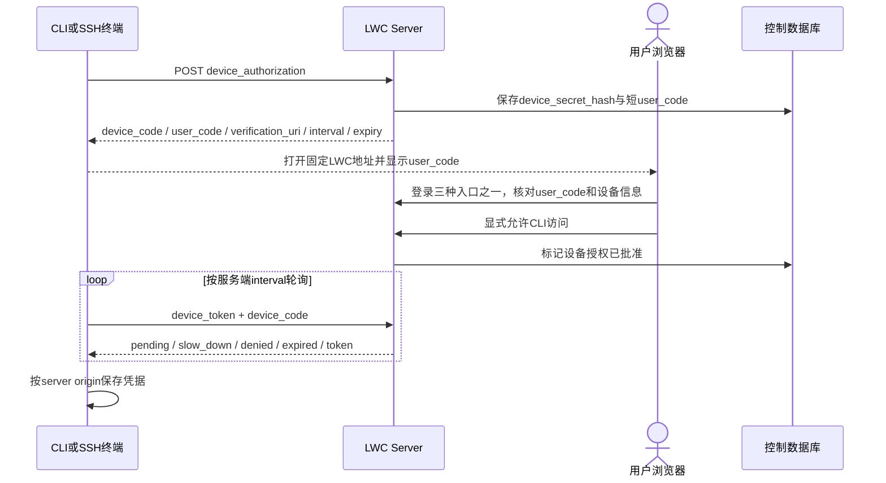

设备批准页面必须展示操作和设备码，不能仅打开链接就自动授权。限制 user_code 尝试次数，device_code 高熵、短有效期、单次兑换，不进入 URL。遵循 RFC 8628 的轮询与错误语义。

凭据优先使用 OS credential store；一日首版若采用受保护文件，必须实现 macOS/Linux 0600 与 Windows 当前用户 ACL 检查，并拒绝符号链接/不安全祖先目录。不允许仅设置 Unix mode 后宣称 Windows 安全。Bearer token 只发给当前登录的 HTTPS origin，禁止跟随跨域重定向携带凭据。


## 7. 自动准实时同步机制

同步由本机守护进程负责，无需Agent每次主动敲sync。安装或首次join时明确启用一次后台服务：macOS launchd、Linux systemd user、Windows当前用户计划任务/长驻进程；只注册当前用户，不要求管理员权限。没有用户服务设施的环境提供前台 `lwc replica run`；不能把前台退出后停止同步称作后台可用。

守护进程在当前账号的复制权限内工作，不直接生成新的语义结论。它监听本机Store变更通知，并定期检查operation/revision，防止漏通知；收到云端长轮询head变化后pull。采用HTTPS长轮询作为唯一首版通知协议，省去WebSocket与SSE两套实现。通知只含space/head，不携带未授权内容。

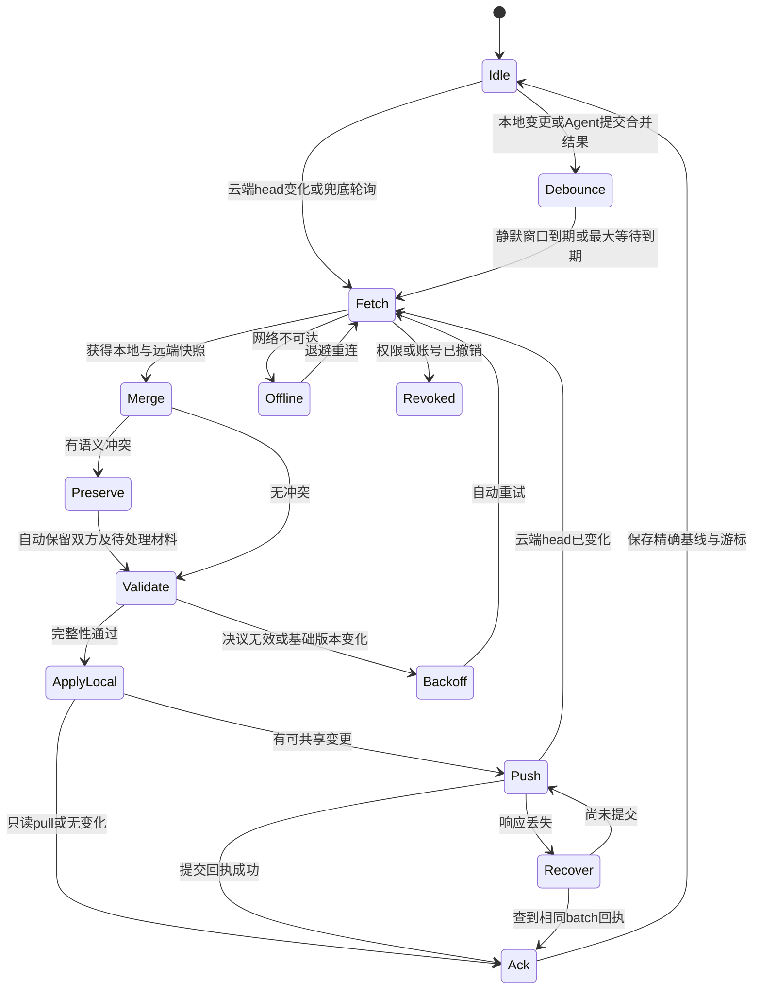

| 配置 | 默认建议 | 含义 |
|---|---:|---|
| local_debounce_ms | 1000 | 合并短时间连续写入 |
| max_batch_wait_ms | 5000 | 持续写入仍须尝试同步 |
| long_poll_seconds | 25 | 服务端head等待，有连接上限 |
| fallback_poll_seconds | 10 | 漏通知与连接恢复兜底 |
| max_parallel_spaces | 2 | 限制快照与网络争用 |
| retry_min_seconds / max | 1 / 60 | 指数退避加抖动 |
| delta_threshold_bytes | 32 MiB | 超过此值改传完整快照 |
| max_transfer_bytes / max_expanded_bytes | 256 MiB / 1 GiB | 单次流式文件及解压后的大小上限，可调 |
| conflict_notice_repeat_seconds | 60 | 只限制已开始处理后的同代重复提示；首次Hook/下一条命令提醒不延迟，未领取持续提示，新输入立即重置 |
| history_retention_days | 30 | 仅复制快照/delta材料保留期；领域记忆不受此值淘汰，保留必要未确认批次 |

目标：服务在线、网络正常、小批次、无语义冲突时约2–5秒传播到另一节点；它是待测验收目标，不是硬实时保证。Agent冲突处理、网络断开和积压另报状态/延迟。

云端长轮询断开只影响通知，不影响数据正确性；数据由版本游标和摘要决定。数据传输完整校验后再导入，不通过请求取消留下半个Store。

## 8. 双向同步详细时序

### 8.1 成员A产生记忆，成员B自动得到本地副本

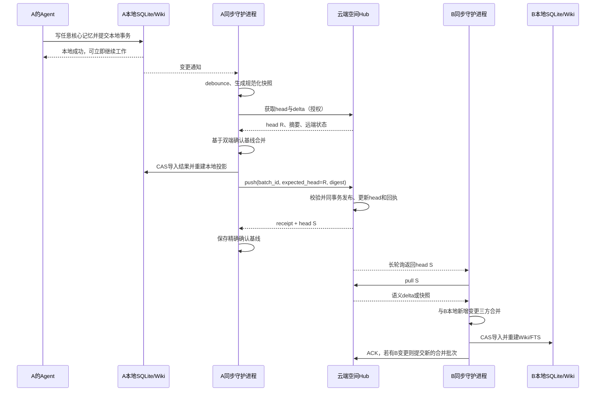

Agent的本地写入成功不等于团队已同步；回执显示local_committed与sync_state，不能为等待网络把本地工作阻塞住。

### 8.2 基线、CAS与确认顺序

每副本保存已确认的local baseline、remote baseline、remote head、last_ack_batch。复用现有directional merge。服务器与客户端不以墙钟时间判断“谁最新”，也不把两个离线副本相同的Plan revision当成同一版本；同步比较规范化payload hash与基线，业务revision仍用于各副本内的状态变更校验。

一轮使用固定快照 L0 与服务器 R0，得出 M：

1. 获取本地一致性快照，记录StoreIdentity L0；拉取R0并验证摘要/基线。
2. 用base_local、L0、base_remote、R0三方合并；可确定的直接合并，语义分歧自动保留双方和冲突材料，再验证M。
3. 以L0身份CAS导入本地M；本地期间又有编辑则重新取快照合并，不覆盖新写入。
4. 推送固定M，服务器检查expected_head=R0。409时重新拉取并合并，沿用已保存的未确认状态。
5. 云端发布后返回batch回执，客户端只确认**该批次快照M**。此时本地可能已有M之后的新编辑，不能把最新本地状态误记成已共享基线。
6. 保存基线与游标采用原子写和可重放回执；新本地变更进入下一轮。

服务器先查询 `(space_id, actor_id, replica_id, batch_id)` 的幂等回执，再判断当前head；相同batch不同payload拒绝。即使其间别人已提交新head，原batch重试仍返回原提交结果，不重复写审计/历史。

### 8.3 离线重连与基线过期

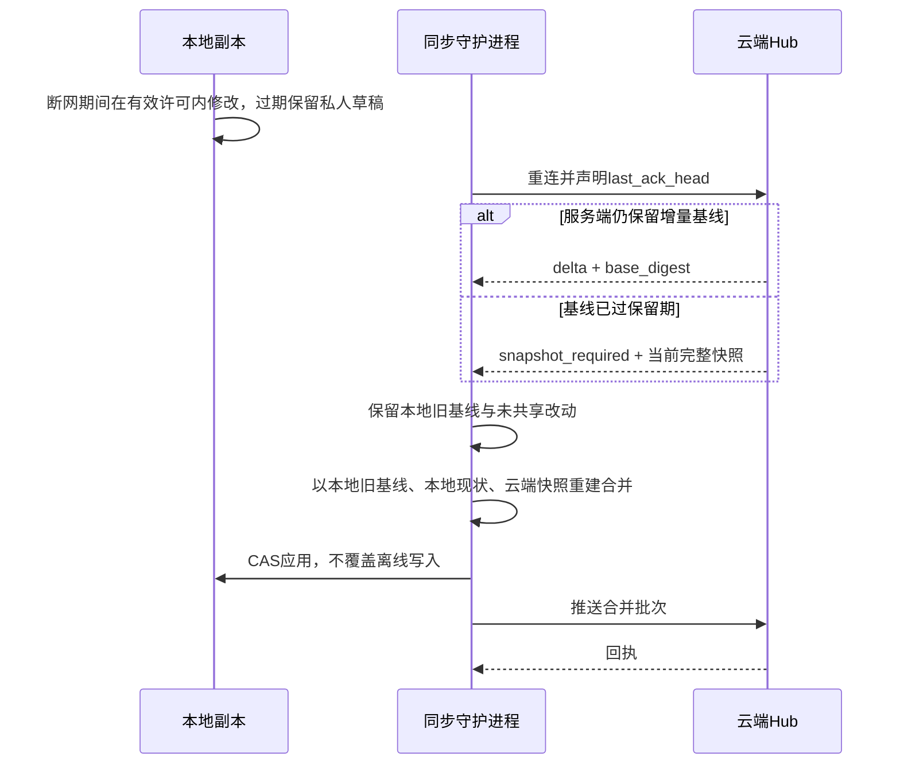

快照回退只替换远端获取方法，不执行“云端覆盖本地”。加入新空间时没有本地历史可用，使用空基线初始化；本地已有独立项目必须走完整核心记忆导入，不猜测两份库是否同源。

### 8.4 删除、旧副本与服务器恢复

删除不能只靠“当前快照中不存在”表达。复制信封增加按 `(kind, logical_key)` 保存的tombstone：删除所基于的对象digest、删除批次和服务器确认head。客户端保留待确认的删除；服务器接受删除时分配head。来源只有在整个引用闭包不再使用时才允许删除。

普通旧副本没有修改该对象时，拉取tombstone并删除；旧副本修改了对象时产生delete_vs_edit冲突，由Agent决议或保留删除意图与可恢复分支。恢复同一个逻辑键必须显式引用被替代的tombstone，不能将旧副本全量上传误判成新建。首次加入的本地空白不代表删除整个云端空间。

首版保留精简tombstone，不随30天快照历史一起清理；大正文按引用和恢复保留期清理。暂不做需要全体离线客户端确认的复杂墓碑压缩算法。备份必须包含tombstone和回执。

服务器恢复旧备份必须变更epoch。客户端不能跨epoch比较head序号，也不能把“本地已确认但恢复后的云端丢失”的记忆当作无变化而舍弃。保留最后确认快照、离线增量和删除意图，进入reconcile模式：能证明共同祖先则正常合并；不能证明则先保留并共享两边合法候选与来源，语义分歧暴露给Agent工具；不阻塞无关内容向新epoch提交。原epoch的batch ID不在新epoch复用。

## 9. Agent自主合并：LWC提供工具，Agent主动使用

**不用人类作为冲突处理步骤，也不由LWC调用模型。** 同步进程先做确定性合并；遇到需要语义判断的分歧，自动保留双方与来源并继续同步，产生可发现、可读取、可提交决议的冲突记录。外部Agent在自己的宿主与已授权任务中自主使用这些工具。

### 9.1 程序与Agent各自做什么

| 程序自主负责 | 外部Agent自主负责 |
|---|---|
| 本地事务、订阅、后台push/pull、断网补发 | 选择相关记忆、理解上下文、判断来源 |
| 相同内容去重、独立变更合并、来源和历史保全 | 综合相互矛盾的结论或重写更好的正文 |
| 默认保留双方、生成稳定冲突ID和完整材料 | 选择候选、提出新合并内容、必要时继续找证据 |
| 权限、schema、引用闭包、状态机、CAS与幂等 | 观察到冲突立即优先合并，自主选择方法 |
| 自动同步有效决议、拒绝旧决议并提供最新材料 | 根据工具返回的冲突/版本变化重新判断 |

LWC不提供模型选择、API key、prompt执行循环或Agent进程池。Hook是即时投递通道，CLI/MCP命令响应是必备兜底，不能要求Agent先想起运行conflict list。任何接入方式都执行同一冲突优先协议。

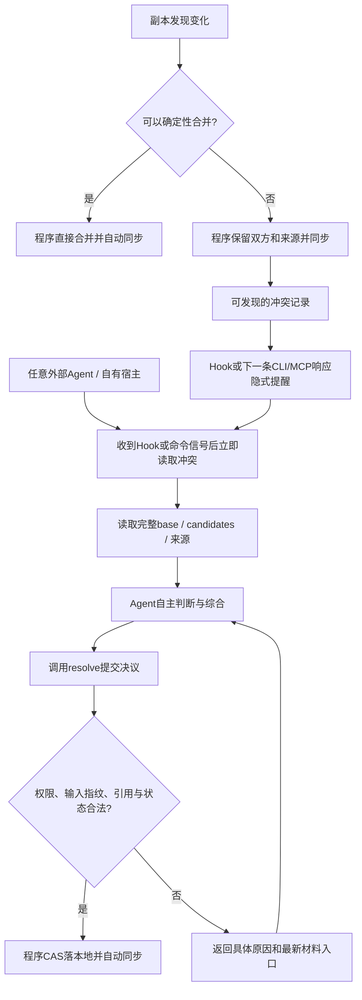

同步不会卡在“等Agent回答”状态，也不会弹出人工merge界面。没有Agent活跃时，双方内容、待处理状态和无冲突改动仍传播到其他成员；有Agent通过工具处理后，程序自动接续验证与同步。

### 9.2 CLI/MCP能力与发现方式

```text
lwc --space team-project conflict list --limit 20
lwc --space team-project conflict show CONFLICT_ID
lwc --space team-project conflict packet CONFLICT_ID
lwc --space team-project conflict resolve CONFLICT_ID --json -
lwc --space team-project conflict status CONFLICT_ID
```

以上为拟新增合同。MCP提供对应的结构化动作，复用同一Store与校验入口，不把CLI字符串交给shell。调用身份来自本机副本绑定；服务端仍复核当前session/grant。提交结果包含local_committed、sync_state、resolution_id与后续读取入口。

**强制冲突处理协议：** LWC一旦持久化冲突，下一次符合空间授权与本机范围的Hook立即提供`replica.conflict.required`；未通过Hook交付时，下一次普通CLI或MCP命令响应必须带同一信号。隐式是面向Agent的机器可读消息，不是向用户弹窗或询问怎么选。主动查询仍可用，但不是提醒前提。

信号只含`server_id/space_id/replica_id`、稳定`conflict_id`、`input_digest`、数量、可信程序生成的下一步工具入口与`must_handle_before_next_task=true`。不把来源正文、候选文本或对端提示拼成指令。信号优先于普通Plan继续/机会建议，但真实事务恢复先恢复；限量输出时保留入口和待处理总数，避免普通提示挤掉冲突。

投递限定当前命令显式空间、项目已绑定空间或宿主提供的当前本机空间集合；后台全局状态只列ID/计数，不能借提醒拉取无权限正文。合并授权来自当前已启用的空间同步及写权限，信号本身不能给viewer扩权或启动别人的Plan。

| 阶段 | 必须行为 |
|---|---|
| detected / pending | 程序事务保存候选、来源、代次和待通知状态；无关对象继续同步 |
| delivered | 仅说明Hook/响应生成成功，不能当作Agent已经观察或冲突已解决 |
| processing | Agent观察到后，下一项任务动作必须先读取packet；工具记录该代材料已领取，自主提交决议，无人工审批 |
| resolved_local | 程序验证输入摘要、领域约束、来源与权限，CAS提交；网络不可用也先完成本地合并 |
| replicated | 同步进程取得该决议云端回执；其他副本pull后关闭对应冲突，不再重算相同输入 |
| stale / interrupted / blocked | 新输入立即重新提醒；进程退出或领取超时后重发；自动修复/有界重试，仍失败则保全并记录机器可读原因，等待条件变化再试 |

Agent观察到后须在当前工具/事务安全边界优先处理，暂缓依赖该冲突记忆的后续工作；不是等待下次任务、手工sync或人工确认。正常读取、来源查询、新证据入库、resolve与无关对象写入仍可用；对冲突对象的普通覆盖写返回`conflict_requires_resolution`和材料入口，避免不经决议丢掉另一个版本。按批处理已有冲突；外部新冲突持续产生时有界续做，不忙等、不阻塞其他空间。

CLI JSON保持原顶层合同，兼容对象可增加`signals`；原始文本/数组/流输出通过独立stderr的`LWC_SIGNAL`帧提醒，不能破坏stdout或改成功退出码，正式Agent调用约定要求捕获该通道。MCP使用原结果之外的结构化信号和显式content块。两种通道在返回前查询本地待处理表，不能等待网络；退出/参数解析等非Store命令可只读已定位的本机待处理摘要，不初始化库、不泄露其他项目。Agent集成说明明确要求读取信号并立即优先处理。

去重按`space + conflict_id + input_digest + 本机上下文`；没有有效领取记录时，后续适用命令继续携带紧凑待办入口。只有读取材料才进入processing，领取超时或新上下文重发；解决状态以CAS回执判定，不能因Hook发送、模型输出“已处理”或保留双方而清除。首版不增加分布式Agent调度平台；多Agent竞争依靠同一输入CAS。

程序保证持久保全、自动同步、投递和提交校验；外部Agent必须遵守立即处理协议。没有运行的Agent或拒不遵守协议的宿主无法被LWC强制推理；此时保留pending并在下次入口提醒，不能伪报完成，更不能悄悄启动LLM。viewer设备保持只读，待解决材料同步给已授权editor；无人可写时保留权限阻塞状态。

### 9.3 语义决议与事实校验

| 冲突类型 | 自动处理与Agent可用动作 |
|---|---|
| 同内容重复提交 | 程序去重，保留引用与必要历史 |
| 不同页面/不同Todo | 程序并集 |
| 同页独立字段 | 程序合并，跨字段约束再验证 |
| 同段落不同结论 | 程序先保留双方；Agent依据来源综合，证据不足保持分歧 |
| 同slug独立创建 | 确定性变体ID；Agent可整合或保留两页，程序校验引用 |
| Todo done与cancelled | 保留状态证据；Agent提交合法决议，不能只按时间戳胜出 |
| Plan步骤/完成冲突 | 保留合法分支和历史；Agent综合后程序验证完成证据和状态 |
| 删除与更新 | 更新内容不丢，保留删除意图；Agent可恢复或整理成有来源的分支 |
| 权限、成员、会话 | 不进入记忆冲突对象；resolve不能改变授权 |

当前resolution v1只支持按字段选candidate 0/1或对象级preserve_both，不能直接接收新合并正文。新增兼容v1的resolution v2：`strategy=merge`提交完整规范化payload，kind/key/conflict_id及输入摘要必须匹配。page可以有新正文；source_hashes必须存在并可验证。Todo/Plan不得删除既有历史，终态有证据。未知字段、超限、伪造来源或非法状态明确拒绝。

合并事件与作者记录由程序追加，Agent不直接改活动SQLite或审计。Agent自由选择推理方式，也可以使用自己的其他工具寻找证据；新证据先走正常source入库，再提交引用它的决议。LWC既不代Agent联网，也不限制宿主本来获准的工具。

### 9.4 保留双方、重复提交与收敛

程序自动保留双方仅是数据安全措施，不算完成语义合并。Agent必须读取完整材料并提交有理由、有来源的决议；证据不足以裁定真假时，合法决议可以把矛盾事实整理为有明确适用条件/来源的共同记录，标注事实仍待证实。不能简单把pending改成resolved来回避处理，也不能编造事实强行得到单一答案。

当前preserve_both对page、memory、Discussion、Todo、Plan等有变体ID逻辑，不支持所有共享kind。新增可复制的冲突材料记录：stable conflict key、候选hash、完整来源、删除意图和整合状态。能形成两个合法领域分支则直接保留；不能表示为两个合法对象时，保留相关引用组件的已验证现状与完整候选材料，无关组件继续同步。

冲突材料按规范化逻辑键和排序后的候选摘要标识，不随机器名、重试时间或左右顺序改变。相同输入重复发现不产生新副本；同一有效决议幂等。首次提醒不受重复提示间隔限制；信号送出不是处理成功，新候选和超时中断会重新提示，不触发模型调用或周期改写知识。

多个Agent均可读取和提出决议。首版不建立分布式Agent任务调度/租约平台；本地输入CAS和服务器head CAS决定哪个结果可发布。旧决议返回stale及最新材料，原提案保留可重用，Agent立即基于新材料续做；已被其他Agent解决则验证回执后结束，不能再次改写制造循环。网络重试由程序完成；语义重新判断由Agent通过工具完成。

静止输入、正常网络与可用存储下，程序确定性合并或保留双方必须收敛。需要语义判断时不把“已同步”“保留完整”和“已整合”混为同一状态；不能保证没有任何活跃Agent时仍产出新的推理结论。

## 10. 避免丢数据、反馈循环和冲突风暴

- 每空间单个本地同步循环；跨空间最多配置数量并行。Agent日常写入不拿网络锁。
- 本地发布CAS保证导入不覆盖同步期间新编辑；云端head CAS保证不覆盖其他成员提交。
- 导入产生的本地operation通知仍可能被观察；按规范化内容digest与已确认批次去重，不能只看operation_id而把每次pull再次当成新push。
- 合并结果只有内容或必要领域历史变化时发布；同步审计、本机receipt、随机时间戳不能混入共享内容摘要造成永远变化。
- 多个Agent同时解决同一冲突时，云端CAS只接受一个当前head；其他节点拉取获准结果后重新比较。错误决议不能因“Agent决定”跳过引用/状态校验。
- 新冲突持续产生时设每轮重算上限与抖动退避，保存快照而不忙等。其他空间继续推进。
- 云端历史压缩必须保留head、必要来源和可恢复快照；与仍需恢复的batch回执关联的对象不能提前清理。
- 同步不可隐式执行Git合并、远程Shell、部署命令或自动完成Plan；这些需要原任务的执行授权。

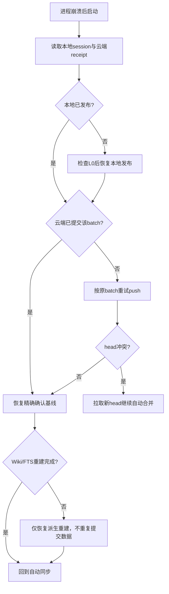

## 11. Todo / Plan共享与执行自由

共享内容包含任务本身、约束、步骤、状态、结果和历史；执行绑定留本地。用户在某个Agent任务中授权执行后，该Agent可自主读取、推进、合并共享计划，无需因同步再问一次。

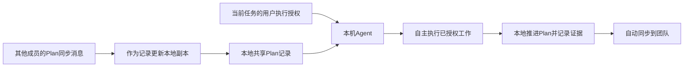

收到他人的Plan只代表数据更新，不代表该Agent获得了执行另一个任务的授权。这保留Agent对已授权工作的自主性，同时避免每个成员机器重复部署、重复发消息或重复修改外部系统。

Todo与Plan保持独立；不自动互相转换。状态迁移遵循现有约束。Plan完成必须有证据，abandoned历史保留，不能为方便合并删除步骤。分享context tracks、Stop one-shot、宿主session ID会造成越权续跑，明确禁止复制。

首版不建立分布式任务执行租约或Agent调度平台。多Agent对外执行去重仍由具体任务协作负责；CAS只保证记忆记录不被覆盖，不保证外部业务动作只执行一次。

## 12. 项目集合与本地检索

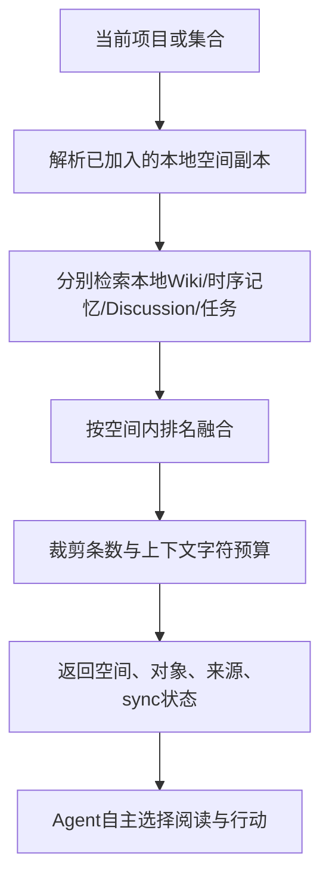

正常召回不需要走云端。结果带space_id、replica_id、对象逻辑ID、领域revision、last_ack_head、last_synced_at与pending/conflict/revoked状态。断网显示陈旧程度，不假装已经看到了其他人最新提交。

首次发现/订阅和云端管理界面的检索要服务端授权；本地查询本地数据无需云端在线。空间撤权后的本地保留副本应标记不可再同步，不能暗示还拥有最新团队权限。

集合内尚未加入的空间显示可订阅状态，未授权空间不泄露名称/统计。正常Agent只加载显式绑定的相关空间，不注入所有成员全部记忆。MCP复用本地Store，不新增公开远程MCP端口。当前MCP并未暴露全部写入能力；首版补齐全部核心记忆的必要读写（page/source/memory/Discussion/Todo/Plan及关联历史、反馈）与conflict的必要动作，与CLI共用领域校验，不仅给支持Shell的Agent提供完整能力。

## 13. API、命令与配置

HTTP基路径`/api/v1`。登录与成员/空间管理沿用统一身份模型；复制新增以下合同。

| API | 合同 |
|---|---|
| GET /auth/providers；邮箱challenge/verify；OAuth start/callback | 三种可配置登录 |
| POST /auth/device_authorization、/auth/device_token | CLI登录 |
| GET /me；GET/DELETE /me/sessions | 当前账号与设备撤销 |
| 团队/成员/邀请/项目/集合/space_grants CRUD | 管理目录与显式授权，不复制到本地记忆库 |
| POST /spaces/{id}/replicas | 注册本机副本，仅获准空间 |
| GET /spaces/{id}/head?after=SEQ&wait=25 | 授权长轮询，返回head/协议版本 |
| POST /spaces/{id}/sync/pull | replica、已确认摘要；返回delta或snapshot_required |
| POST /spaces/{id}/sync/push | batch_id、epoch、base_head、base_digest、payload_digest、artifact_id、格式版本 |
| GET /spaces/{id}/sync/receipts/{batch} | 验证actor/replica后恢复提交结果 |
| POST /spaces/{id}/sync/ack | 精确应用后的head，不用客户端ack替代服务器提交 |
| POST /spaces/{id}/sync/transfers | 有界流式上传临时artifact，返回服务端生成ID；绑定actor/replica/space |
| GET /spaces/{id}/snapshots/{digest} | 授权流式下载固定对象，不接受任意路径 |
| GET /spaces/{id}/audit / status | 管理可见的历史与同步状态 |

首版流式落临时文件，完整校验后发布；网络中断重传该文件，不先实现分块断点续传。上传未提交artifact设TTL及每用户磁盘额度，提交只接受同space/actor/replica拥有的artifact。

提交解压限制、blob数量/大小、核心类型注册表、摘要、引用完整性及各领域状态/历史在进入canonical事务前验证；不执行传入SQL、任意CLI argv或不可信SQLite触发器。规范化传输数据库仅按既有受限只读解析器读取，不能当作服务端主库打开执行迁移。

```text
lwc server run --config /etc/lwc/server.jsonc
lwc login --server https://memory.example.com
lwc space join SPACE_ID --server company --as team-project
lwc space use team-project
lwc --space team-project page put ...        # 本地事务，自动安排同步
lwc --space team-project search "部署规范"   # 本地检索
lwc --space team-project todo list
lwc --space team-project plan advance ...
lwc replica service install                   # 当前用户后台服务，一次启用
lwc replica status --space team-project
lwc replica now --space team-project           # 诊断/主动追赶，不是日常必要操作
lwc replica config --space team-project --debounce-ms 1000 --poll-seconds 10
lwc replica pause --space team-project
lwc replica resume --space team-project
```

目标命令尚未实现。固定使用 `lwc replica ...` 管理云端复制，保留旧SSH `lwc sync HOST ...` 的解析。固定使用 `lwc server ...` 运行云端，保留现有 `lwc serve --mcp`；不能占用已有命令改变宿主启动方式。

本地配置保存服务器origin、空间alias、replica路径、同步与提示参数；凭据在独立安全存储。项目可提交不含secret的绑定建议，但自动登录、启用后台服务和上传已有私人内容不能由仓库文件偷偷触发。

服务端配置：public_base_url、data_dir、listen、trusted_proxy、各provider enabled及凭据文件、SMTP、会话/OTP限制、空间/历史/连接配额。enabled=true配置不全则启动失败；未启用provider隐藏。零登录入口不能对外启动；没有默认万能账号或验证码。

## 14. Web、部署与恢复

管理端采用React + TypeScript + Vite + shadcn/ui，独立放在 `admin/`，共享现有 `web/src/tokens.css` 配色与Markdown安全规则，保留Lit本地Viewer。布局、角色可见性、路由和10个关键ASCII原型见[UI设计](admin-ui.md)。

Web提供登录/设备确认、团队成员、显式grant、项目集合、空间知识、时序记忆、Discussion、Todo/Plan及来源历史浏览、身份绑定/会话撤销、同步head/副本状态与审计。首版不再做第二套网页知识编辑器：记忆写入来自本地Agent/CLI，管理面写入仍在云端。

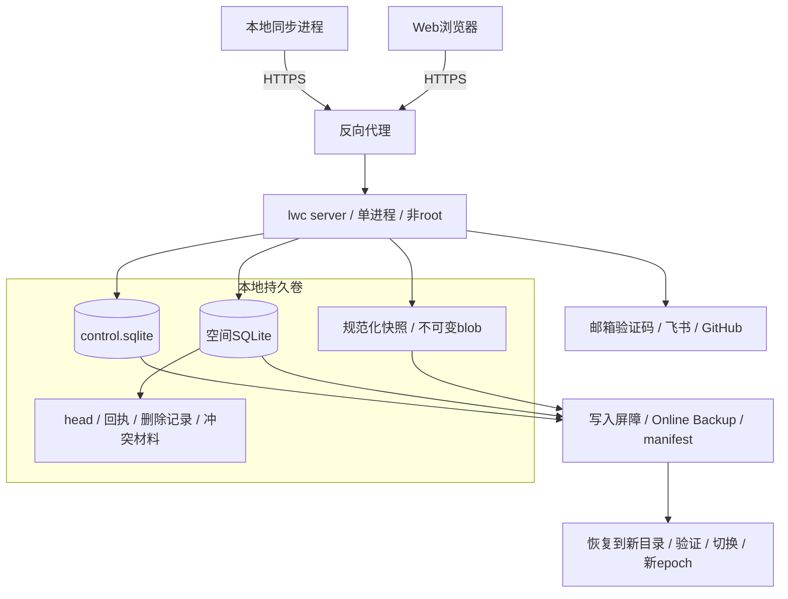

服务端单进程独占data_dir；数据库用本地持久卷，不放共享文件系统。空间创建为creating→ready，崩溃可恢复。长轮询设连接数、超时和按用户速率限制。文件名只由server生成的opaque ID决定，客户端不能传磁盘路径。

权限撤销与数据发布共用按团队（个人空间按owner）的短期读写门闩，避免鉴权后成员已被移除仍新提交；锁顺序固定。网络上传与Agent处理在锁外，最终校验与发布在锁内，运行期不持锁等待外部工具调用。长轮询唤醒后再次鉴权；下载中断按可取消边界执行，但已发送字节无法撤回。

备份进入短维护窗口，等待写入结束，使用SQLite Online Backup和明确的快照文件manifest；恢复到新目录验证后切换，并吊销旧会话。客户端重连发现server epoch变化后重新验证副本，保留本地未共享工作，禁止以服务器回滚为由丢弃本地新内容。

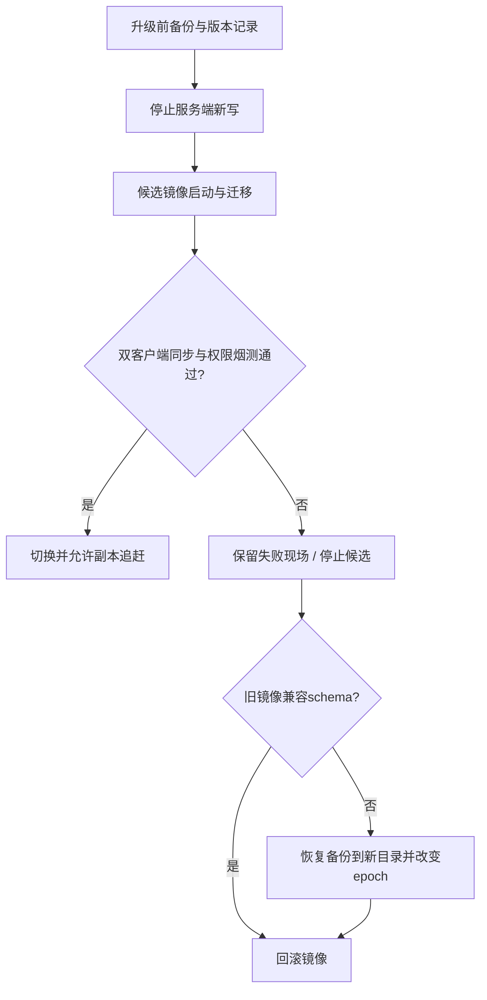

## 15. 必须通过的验收与风险边界

| 场景 | 正确结果 |
|---|---|
| A写每类核心记忆，B保持空闲 | 无手工sync，B本地SQLite语义等价，Wiki/索引可重建；来源链和反馈不丢 |
| 离线旧时序事件超出原年龄/容量阈值 | 未ACK内容保留；不因本机清理生成云端删除 |
| Hook缺失或被压缩，下一次普通CLI/MCP调用 | 响应携带冲突优先信号；不依赖先查list，不损坏原命令输出 |
| 已投递但Agent未读、重启或旧决议stale | 待处理不消失；下次入口补发，Agent优先续做 |
| 网络断开后本地写入并重启 | 本地可读写；重连后自动补发，不能丢失未共享状态 |
| A/B同时改同一段落 | 程序保全并同步；外部Agent通过CLI/MCP提交决议，不要求人类merge |
| 没有活跃Agent/Agent提交非法结果 | 非冲突内容继续，双方版本完整保留；非法决议明确拒绝并提供续做材料 |
| 提交后丢响应 | 相同batch恢复相同回执，历史/审计无重复 |
| 合并期间本地又写入 | CAS失败重新合并，新写入不被覆盖 |
| 三节点轮流合并后空闲 | 最终共享语义一致，不因投影或审计产生循环push |
| Plan完成与修改并发 | 合法状态、来源和历史均保留，不伪造完成证据 |
| 成员撤权或viewer尝试push | 服务端拒绝；本地工作保留，不承诺远程抹除 |
| 其他空间/其他团队blob ID | 拒绝，不泄露内容或可枚举元数据 |
| 快照基线过期、服务端恢复旧备份 | 重新快照并保留本地离线改动，不作云端覆盖 |
| 未配置某登录provider | 明确未启用；配置后的真实回调另行验收 |

账号与第三方服务首次配置、失效凭据的重新认证是身份流程，不是“冲突需要人工处理”。没有Agent运行时，LWC仍自动同步和保全；不能把没有发生的语义判断伪装成已整合。

共享撤权不能撤回已下载数据；共享内容可能已经进入用户Agent上下文。宿主管理员可以读本机磁盘；首版不宣称端到端加密或恶意宿主隔离。

## 16. 参考与待评审项

腾讯项目的集中授权、显式选择记忆范围、限量召回适用于LWC；它的代理注入不作为本地优先复制的替代，详见[参考评估](reference-tencent.md)。

认证依据：[GitHub授权与PKCE](https://docs.github.com/en/apps/oauth-apps/building-oauth-apps/authorizing-oauth-apps)、[RFC 8628设备授权](https://www.rfc-editor.org/rfc/rfc8628)、[OWASP邮箱验证](https://cheatsheetseries.owasp.org/cheatsheets/Email_Validation_and_Verification_Cheat_Sheet.html)。[飞书token](https://open.feishu.cn/document/authentication-management/access-token/get-user-access-token)及[用户信息](https://open.feishu.cn/document/server-docs/authentication-management/login-state-management/get)页面已定位，本次文本抓取没有完整正文；字段与应用类型在适配器编码时核实。

无新增必须由用户回答的问题。工程默认是单服务端、当前用户同步守护进程、每空间全部核心记忆副本、CLI/MCP工具和必备冲突投递兜底。部署者配置三种登录；Agent由使用者自己的宿主运行。实现计划以v6、同步算法评审及管理端UI设计为准，在线CRUD草案和程序调用Agent的草案均已替换。
