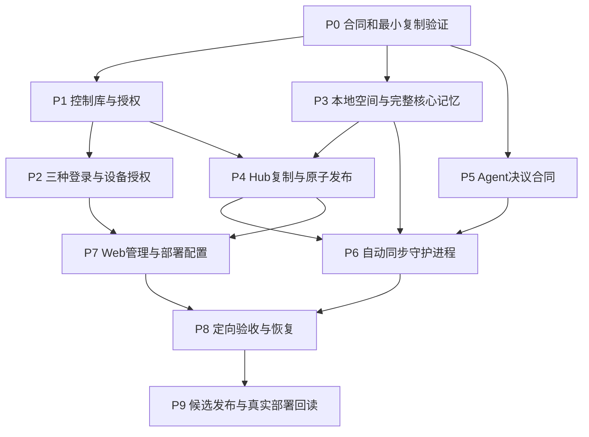
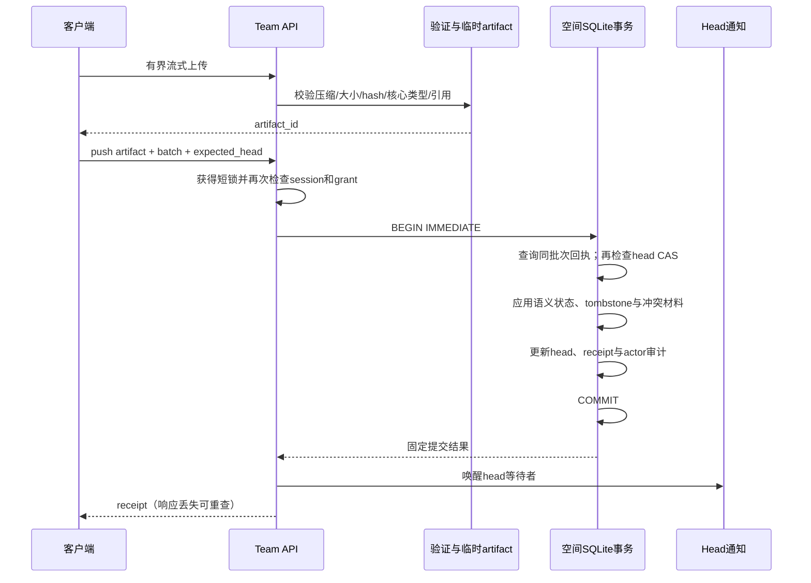
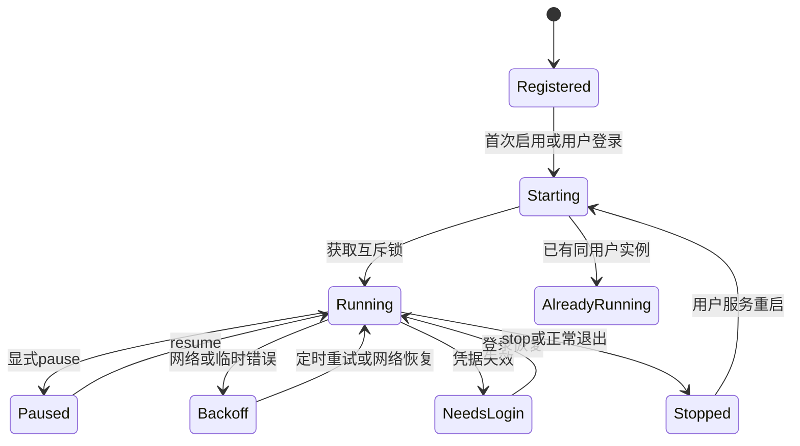
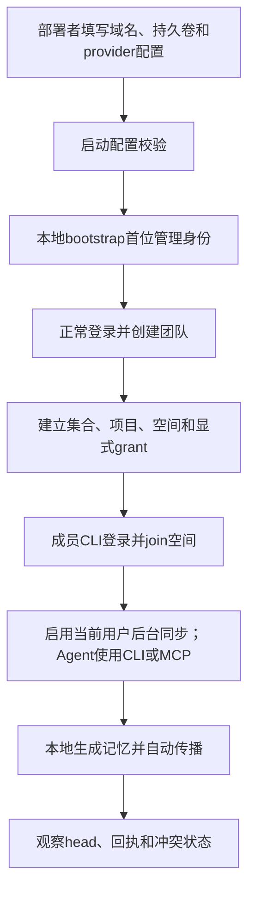
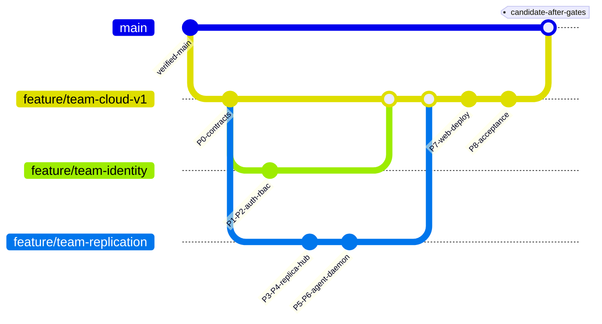

# LWC 团队版：一天实施与编码计划

状态：架构方向已获用户确认，正在按执行计划编码；实际进度和验证证据以LWC Plan为准。日期：2026-09-28。基线：`v0.18.6 / 7e065db`。全部Rust编译和测试在Pro的隔离构建目录执行。

本计划以[本地优先设计 v6](design.md)为准：本地SQLite/Wiki完整副本、自动双向复制、Agent自主合并；邮箱验证码/飞书/GitHub；全部核心持久记忆；空间默认拒绝；Hook/下一条CLI-MCP响应提醒后Agent立即优先合并。不是在线CRUD版本的计划，也不把自动同步留到下一期。

执行状态唯一归属：LWC Plan `84715af7b63db12278d87a62cf00f13c`，使用 `lwc --scope project plan brief 84715af7b63db12278d87a62cf00f13c`读取。本文件保存任务说明和验收合同；[管理端UI设计](admin-ui.md)定义React界面、功能范围、间距和ASCII原型。

## 1. 交付形式与24小时目标

同一个仓库、同一套Store与领域规则，增加 `lwc server` 服务端运行模式和 `lwc replica` 本机同步进程。CLI、MCP、Skills仍从本地Store工作。第一版不用fork，不把身份和授权做成可绕过的插件，不全面拆crate，不新建微服务群。

首版交付物：服务端Docker镜像和Compose、部署配置样例、三种登录、成员/集合/空间管理Web、本地副本命令、当前用户后台服务、CLI/MCP对等工具与宿主发现协议、自动同步/恢复、定向验收证据与升级/回滚说明。沿用现有客户端分发渠道，发布号实施时根据main实际版本确定，不提前占用版本。

**24小时是高强度实施目标，不是已获得证据支持的时限保证。** 临界路径是复制语义与无人值守恢复；现有Store可复用，但公开网络认证、自动调度和Agent生成payload仍是新增代码。优先削减装饰图表、动效和非必要管理便利项；对齐、间距和可读性属于UI验收要求，不能删掉三种登录、本地存储、自动同步、权限或数据保全来满足钟表时间。

真实飞书/GitHub回调与真实邮件投递由配置好的部署环境验收。缺配置时可完成适配器和合同测试，但状态必须写“真实接入待配置”，不能报三种登录均已实测。LWC的服务端和客户端均不配置模型密钥、调用LLM API或启动Agent。Agent在自己的宿主中主动使用CLI/MCP。

## 2. 24小时窗口与依赖

| 相对时间 | 主要工作 | 该窗口必须产生的证据 |
|---|---|---|
| H0–H2 | 冻结复制/授权/CLI-MCP合同；用真实SQLite做最小双副本验证 | 两份真实SQLite全核心记忆往返，含时序/Discussion/反馈/来源链；无遗漏及运行授权复制 |
| H2–H6 | 控制库、认证与空间授权；本地副本定位；React公共布局和token | 未授权不能注册/下载；不联网仍可操作副本；相同batch只有一次提交 |
| H6–H10 | HTTPS pull/push、基线、回执、删除和epoch；接通双端 | A提交后B可自动追赶；断网期间A/B在有效缓存许可内可写 |
| H10–H14 | 守护进程、服务注册、Agent v2决议与保留双方 | Hook/命令兜底提醒并优先决议；无Agent保全；CAS竞态不丢数据 |
| H14–H19 | React管理页面与真实接口；集合/知识/时间线/Discussion/任务/权限/同步视图、部署与备份 | 用户能自助配置登录与grant、绑定空间、看到真实sync状态 |
| H19–H22 | 定向集成、故障注入、平台服务兼容检查 | 本文G1–G6证据；修复实际发现的阻断问题 |
| H22–H24 | 候选打包、既有发布CI、文档与部署烟测 | 精确候选SHA、分渠道发布结果、仍未完成的外部验收项 |

此窗口允许独立模块交错推进，并非把所有模块各做一遍后才首次集成。H6必须出现可运行的最窄纵向路径；如果H10还未做到双副本保全式同步，立即更新工期风险，不继续堆Web功能。实际耗时与CI排队分别记录，不用并发Agent数量推导完成保证。



## 3. 文件边界：复用与最小改动

下列是拟新增/修改位置，不代表文件已经存在。按职责成组，不为每个表或接口建立一套repository/service/factory。

| 位置 | 改动职责 | 明确复用或保留 |
|---|---|---|
| `src/cli/definitions.rs`、`dispatch.rs`、`helpers.rs` | server/login/space/replica命令；统一空间目标解析 | 现有 `serve --mcp` 与 `sync HOST` 语法 |
| `src/scope.rs`、`src/mcp.rs` | 显式space及本机绑定解析；补齐全部核心记忆/冲突的结构化工具 | 旧project/global/all、绝对projectPath校验 |
| `src/team/mod.rs`、`control.rs`、`policy.rs` | 服务进程、控制库迁移、统一授权函数与治理审计 | SQLite、Axum、Tokio |
| `src/team/auth.rs` | 邮件验证码、静态三provider适配、会话与设备授权 | 一套身份和会话模型，不做动态插件注册 |
| `src/team/sync.rs` | head/pull/transfer/push/receipt/ack；流量和磁盘配额 | Store规范化传输与发布 |
| `src/replica/mod.rs`、`daemon.rs`、`conflicts.rs` | 本机副本注册、同步服务启动、冲突工具与决议校验 | 一套状态机，不另建任务队列服务 |
| `src/store/sync.rs`、`sync_publish.rs`、`temporal_memory.rs`、`discussion.rs` | 核心覆盖、稳定历史与子ID合并、未ACK保留、v2决议、发布事务 | 现有hash、delta、CAS、checkpoint、派生恢复 |
| `src/store/todo.rs`、`plan.rs` | 必要的导入状态/历史校验补齐 | 状态机仍只维护一份；不另写HTTP领域实现 |
| `src/agent/signals.rs`、CLI响应层、MCP响应层与集成指引 | 高优先级冲突信号、无Hook命令兜底、领取/中断重发和立即处理协议 | 不导入其他成员context，不把同步通知当执行授权 |
| `admin/` React应用与共用组件 | 登录、管理目录/grant、空间只读查看、同步/冲突/审计 | React + TypeScript + Vite + shadcn/ui；复用LWC视觉token和Markdown安全规则，保留Lit Viewer |
| `deploy/team/` | Dockerfile、Compose、server.jsonc样例、运行说明 | 一服务实例、一持久卷；已有反代可复用 |
| `tests/team_cli.rs`、`tests/replica_cli.rs`、少量既有回归 | 通过真实CLI/临时库测试重要不变量 | 沿用现有Rust测试工具，不新增测试框架 |

`src/main.rs`仅添加必要模块声明。当前rusqlite Connection不能被随意跨异步线程共享；同步Store事务在受控blocking执行段运行，每空间串行发布，禁止网络await期间持有SQLite事务。

依赖选择：已有Axum/Tokio/rusqlite/serde/jsonc-parser/sha2/zstd直接使用。团队管理端按用户要求新增React + TypeScript + shadcn/ui（Vite构建）；Lit只用于既有Viewer。HTTPS客户端、安全随机/HMAC和SMTP使用维护中的成熟库，优先检查现有依赖树并统一版本；不手写TLS、OAuth密码学或SMTP。需要新增的直接依赖在P0清单中列出，不因“已有外部curl”就把常驻认证通信变成shell拼接。配置沿用JSONC，避免只为样例引入TOML解析器。

## 4. P0：冻结可验证的合同

输入：本文、设计v6与[同步算法评审](sync-engineering.md)；`export_sync_state`、`merge_sync_states_directional`、`resolve_sync_conflicts`、`publish_sync_state`的实际行为。

工作：

1. 定义 `lwc-team-sync/1`信封、完整核心对象注册表版本、epoch/head、artifact/receipt、tombstone、冲突材料和CLI/MCP输入/输出；未知版本拒绝并保留本地待同步状态。
2. 固定 `--space` 与旧scope组合规则：显式space不能和显式global/all并用；无显式space时，只对支持共享的命令采用用户已设置的默认绑定。memory、Discussion、Todo、Plan与Wiki必须使用同一默认目标，禁止漏路由；Book/Tutor/Practice插件专有运行时不重定向。
3. 确认原本地project/global库保持独立；专用副本发布时保留本机tracking与调度状态。导出过滤后不能清空原库的未共享对象。
4. 按设计§4.2为全部核心表/语义字段建立覆盖清单；用每类一项的小样本验证时序事件、Discussion历史、来源版本、反馈等完整往返。拆分领域变更历史与本机operation，禁止同步反馈循环。
5. 对当前v1只选候选的限制、preserve_both支持的kind清单作显式测试，再扩展v2；不能把推断当现有能力。
6. 为时序事件/Discussion项/Plan步骤定义稳定子ID合并及领域约束；冻结原始历史ID/父版本方案，禁止整数组最后覆盖；沿用双端基线，不另建向量时钟引擎。
7. 冻结`replica.conflict.required`信号、原输出兼容、材料领取和超时重发合同；区分delivered、processing、resolved_local、replicated，首次提醒不得受重复限流压制。
8. 团队副本关闭本机独立领域淘汰，保护未ACK和冲突依赖；核心语义表覆盖检查禁止新增核心类型后静默漏同步。

完成条件：合同样例可由双方解析；无网络双副本的语义往返成立，源库摘要不变；合同包含至少一个新正文决议和一个非法决议反例；v2实际执行验证在P5完成。

## 5. P1/P2：控制面、RBAC与登录

### 5.1 控制库最小数据合同

| 表组 | 主键/唯一约束与规则 |
|---|---|
| users、identities、verified_emails | identity唯一 `(provider, namespace, subject)`；邮箱相同不自动绑定账号 |
| sessions、login_challenges | 只存token/验证码摘要、用途、过期、状态；消费和失败次数原子更新 |
| teams、memberships | `(team_id,user_id)`唯一；成员移除立即影响新请求 |
| invitations | 高熵单次token摘要、团队/实例、目标身份、期限；接受不自动grant所有空间 |
| projects、collections、collection_projects | 引用同团队；集合不复制grant |
| spaces、space_grants | team_owner/user_owner互斥；grant按space+user唯一；viewer/editor/manager |
| replicas | space、user、device、status；外来replica_id不能冒充本人设备 |
| control_audit | actor、action、target、结果、理由；无验证码/第三方token/正文 |

每张可修改管理对象有revision；Web修改携带expected_revision，避免两个manager静默覆盖授权。变更grant与最终共享提交按固定顺序取得团队短锁并复核，网络IO始终在锁外。

### 5.2 登录实现顺序与完成条件

1. 先实现账号/session、邀请和本地bootstrap，不把第一个访问者设为管理员。
2. 邮件challenge与verify：6位/5分钟/5次默认值、账号/IP/总量限流、重发失效、发送超时；通用错误不泄漏注册状态。
3. OAuth公共state/浏览器绑定/回调验证，再写GitHub和飞书各自的code交换与subject映射；不建立认证插件框架。GitHub走S256 PKCE；飞书参数按部署应用类型查官方合同。
4. 账号主动绑定与移除最后登录方式保护；被占用identity拒绝，不自动合并已有用户。
5. LWC设备授权、CLI凭据存储、session撤销；用户只在首次登录核对设备，日常sync不用再次批准。
6. 每种provider未配置隐藏、错误启用启动失败；日志只报配置项名称。

完成条件：同一个账号可显式绑定三种身份；登录不等于获空间授权；device code重放失败；停用账号使新head/pull/push/长轮询唤醒失败。凭据文件需要Unix权限及Windows用户ACL落实后才能报跨平台完成。

## 6. P3：本地副本与Agent读取路径

1. `space join`检查已登录账号、显式grant，注册replica，创建专用目录和空Store；首次快照验证后导入。目录创建中断可以幂等恢复。
2. 当前用户的副本注册表记录绝对路径和server/space/replica身份，后台进程不依赖启动cwd扫描整个磁盘。路径移动后由显式rebind修复，副本复制到另一设备时重新注册，不复用原replica身份。
3. 全部核心命令（page/source/memory/Discussion/Todo/Plan及关联历史/反馈）通过同一个目标解析入口定位本地Store。只对有完整领域合同的命令开放space；不开放对控制库的任意路径访问。
4. MCP保留projectPath，space只选择已加入的副本；搜索集合时从本地注册表扇出，带空间标识合并结果。补齐全部核心记忆与conflict的必要读写动作，直接复用Store及合同校验；不启动CLI子进程，不开放任意argv。纯MCP Agent与CLI Agent具有对等的共享工作能力。
5. Agent Hook与下一条CLI/MCP响应必须读取适用空间的待解决冲突并隐式提示；处理指引要求Agent观察后立即优先合并。Plan/Todo的track仍是本机context；导入不得改变它的owner或启动另一个任务。
6. 旧项目接入时预览全部核心记忆数量和引用闭包，完整导入目标个人或团队空间；未纳入Store的Wiki先显式检查和导入。目标确认后自动持续同步，不要求逐页审批。

完成条件：拔掉网络后仍能检索，并在有效缓存许可内新建知识和推进Plan；memory和Discussion与Wiki写入同一绑定空间；不混入其他未选库或宿主凭据；新版本未配置team能力时旧CLI/MCP行为不变。新成员空副本首次加入不能表示对云端全量删除。

## 7. P4：Hub复制、事务与恢复

### 7.1 请求与回执合同

下面是新协议的结构示意，`<...>`是文档占位符，不是可提交值；实际解析必须验证类型、ID、摘要及长度。

```json
{
  "protocol": "lwc-team-sync/1",
  "share_schema": 1,
  "server_epoch": "<opaque-epoch>",
  "space_id": "<space-id>",
  "replica_id": "<registered-replica-id>",
  "batch_id": "<stable-request-id>",
  "base": {"head": 41, "digest": "<sha256>"},
  "artifact_id": "<server-issued-upload-id>",
  "payload_digest": "<canonical-shared-state-sha256>",
  "transfer_kind": "delta"
}
```

actor来自服务端session，不能由payload指定。传输文件摘要和规范化内容摘要分开：前者验证字节，后者用于去重/基线；格式号不能替代摘要。

```json
{
  "batch_id": "<same-request-id>",
  "server_epoch": "<same-epoch>",
  "accepted_head": 42,
  "accepted_digest": "<exact-submitted-state-digest>",
  "committed": true,
  "derived_state": "ready"
}
```

成功表示canonical状态、head与receipt已提交；投影若恢复中返回 `derived_state=rebuilding`，不得因此重放canonical写入。客户端只确认这份固定M快照，不确认本机随后新增的内容。

| 错误 | 客户端自动行为 |
|---|---|
| 401/session失效 | 保留本地工作，暂停网络，清楚报告需要重新认证 |
| 403/revoked或viewer写入 | 保留未共享工作，不自动切换目标/身份，不无限重试 |
| 409/head_changed | 拉取最新head，重新合并，使用新batch；旧batch状态先查receipt |
| 409/batch_payload_mismatch | 拒绝复用，记录协议错误；不能覆盖原回执 |
| snapshot_required | 保留本地旧基线，完整拉取远端后合并 |
| epoch_changed | 进入祖先核验/reconcile，保留已确认但可能被服务器恢复丢失的版本 |
| 413/422/unsupported_format | 保留payload与诊断，不拆掉引用或静默丢对象；调整配置/版本后恢复 |
| 429/网络/5xx | 按Retry-After或指数退避加抖动，恢复时先查可能已提交批次 |

### 7.2 原子发布实现

不采用“调用现有发布提交，再补写team receipt”的两事务实现。对 `sync_publish.rs` 作窄扩展，让team提交的head、actor、replica、batch、digest与canonical对象在同一事务内落库；旧SSH/Archive调用保持原路径。



不可信传输SQLite只使用受限读取和schema校验，不执行其触发器/SQL，不作为canonical数据库迁移。临时artifact按服务端opaque ID、actor、replica和space隔离，限额及TTL清理。首版整文件有界流式传输，中断重传；暂不另做分块断点续传。

### 7.3 删除与保留

每空间增加head/receipt/tombstone/冲突材料表或同事务索引。tombstone按 `(kind,logical_key)`记录被删digest、删除batch与确认head；旧副本未改动随删除，旧副本有改动进入冲突。旧payload不能无意复活已删除对象。

30天历史窗口只影响可直接下发的delta/快照，不能清掉阻止旧副本复活的tombstone或仍被引用的source blob。receipt保存精简幂等信息；完整历史可压缩，精简receipt首版不自动丢弃。服务器恢复备份改变epoch；旧批次不能跨epoch复用。

完成条件：本地/云端CAS、响应丢失、导入后崩溃、基线过期和epoch变化均有可重复的小测试；任何路径不以云端直接覆盖本地作为恢复策略。

## 8. P5：Agent可自主使用的合并工具

### 8.1 能力接口，不接入Agent运行时

LWC提供 `conflict list/show/packet/resolve/status`，MCP提供同等结构化动作；程序不配置模型、不托管Agent、不启动推理进程。统一输入合同、错误码、版本与回执，使任何宿主中的Agent都能使用。

CLI和MCP共用入口，按page/source/memory/Discussion/Todo/Plan/conflict等核心领域分组暴露强类型动作，并提供 `inspect contract`。当前MCP不具备这些完整写能力，必须在首版补齐。每个调用带projectPath和明确space；mutation带request_id及必要expected_revision；不能把自由文本当作shell命令执行。

冲突packet包含固定base/local/remote摘要、稳定conflict ID、完整候选与来源。复用现有 `next_sync_conflict_batch` 的20项/256KiB预算起点；大对象分页/材料读取工具显式给出总量、游标和hash，不静默截断。Agent自行选择读哪些补充材料、如何综合，不由LWC硬编码推理步骤。

输出复用v1候选选择与preserve_both；新增v2 merge结构示意：

```json
{
  "version": 2,
  "decisions": [
    {
      "kind": "page",
      "logical_key": "deployment-notes",
      "conflict_id": "<exact-input-conflict-sha256>",
      "strategy": "merge",
      "payload": "<complete normalized object, actual type must be object>"
    }
  ]
}
```

实际payload是强类型完整对象，不是上面的占位字符串。程序验证kind/key、输入hash、schema、来源闭包、历史和状态；Agent可自由生成新正文，不能伪造source或历史作者。新来源先通过source工具入库。LWC追加合并事件并CAS发布，任何已存在的网络同步错误都由程序重试。

### 8.2 必须投递并立即处理的无人工闭环

完整Mermaid时序见[同步算法评审§5](sync-engineering.md#5-agent立即处理的完整闭环)，响应兼容和状态定义见[设计§9.2](design.md#92-climcp能力与发现方式)。实现必须遵守：

1. 同步程序事务持久化冲突候选、来源、input_digest和待通知状态；独立变化继续传播。保全不等于解决。
2. 可用Hook投递高优先级信号；下一次同范围普通CLI/MCP命令响应必备兜底，无需先查list。纯stdout合同不变，原始输出的独立信号通道必须由Agent适配捕获。
3. Agent看到信号后在安全工具边界立即优先packet→取证→resolve；不是“可选提示”。程序不调用模型、不启动Agent，不请求人类选择候选。
4. 材料领取才记录processing；信号发出不能清除pending。新代次、领取中断/超时、宿主恢复重发；依赖冲突对象的普通覆盖写返回材料入口，无关读写继续。
5. v2决议校验来源、历史、领域状态、权限和输入CAS；本地成功即resolved_local，自动取得远端回执再标replicated。stale立即重读；已被其他Agent处理则回读回执，禁止循环改写。
6. Agent证据不足时生成带来源/适用范围的分歧整合记录，不造单一结论；无法合法整合保留机器可读阻塞并在条件变化后续做。无Agent/无写权限仍保全和投递，不假报完成、不扩权。

完成证据须包含真实宿主Hook路径及无Hook CLI/MCP路径，分别报告工具合同测试和实际Agent观察后优先处理的行为。Agent自己的推理不可由程序强制保证，但程序能够保证提醒、保全与提交边界。

### 8.3 通用保留与收敛

page/memory/Discussion/Todo/Plan优先复用确定性变体ID。当前不支持preserve_both的source/tag/relation等，保留关联组件合法现状及完整候选材料，修复共享入口；无关变化继续同步。冲突key由对象key和排序后的候选hash决定，避免左右副本顺序导致重复材料。

对同一输入已经生效的resolution重复提交返回原回执；stale返回最新输入和可重用提案。多个Agent都能提交，CAS保证发布顺序，首版不增加Agent任务租约平台。无有效领取时持续携带有界入口，领取超时/新代次重发；不得制造Todo副本或大量重复材料。

完成条件：外部Agent仅凭公开CLI或MCP，完成发现→读材料→提交→查看自动传播；两种入口都验证合同一致。非法JSON、伪来源、旧conflict_id与无权限写入被程序拒绝；无任何Agent时双端仍保全、同步且收敛。真实宿主测试与脚本化工具合同测试分别报告，不把后者当作真实Agent行为证据。

## 9. P6：常驻同步与本机服务

每空间一条串行同步循环；每用户一个后台进程；同一路径有进程互斥锁，第二个进程只报告已有实例。可按空间pause/resume；配置热加载只在下一轮边界生效，不能中途改掉batch和目标。

变更触发不用盯Wiki文件。核心事务同时记录可恢复的待同步版本，提交后轻量通知加operation/revision兜底扫描；提交后崩溃或通知失败都不能漏同步，也不回滚用户已落盘记忆。每轮先比摘要，无语义变化不传文件。head长轮询与本地debounce均可唤醒，参数见设计第7节。

| 平台 | 实施方式 | 最小平台验证 |
|---|---|---|
| macOS | 用户LaunchAgent，固定可执行文件路径和argv | 安装、启动、退出后继续同步、stop/uninstall不删库 |
| Linux | systemd --user；无user manager给明确前台模式 | 有/无user manager各一次；SSH退出后的运行状态如实说明 |
| Windows | 当前用户计划任务启动持久进程，明确账户与触发方式 | 路径空格/Unicode、启动/退出、凭据ACL、第二实例保护 |

后台进程默认随用户登录会话运行；Windows未登录、电脑休眠或关机不保证同步。恢复唤醒后自动补齐。需要无人登录也运行的主机，可由部署者把前台命令纳入自己的系统服务，不偷偷提权安装。



本地session至少记录exported→merged→local_published→remote_committed→acked，阶段原子写；恢复先查固定batch回执，不能凭“上次没有收到200”推断未提交。保存快照的CAS身份和基线分别管理，正确处理提交期间又有本地编辑。

状态输出包括last_local_commit、last_ack_head、pending、last_error_code、next_retry、conflicts_pending、conflicts_preserved、conflict_notice_state、conflict_generation、derived_state；不记录正文/token。MCP/Agent拿到简洁状态即可，避免每轮把网络日志注入上下文。

## 10. P7：Web与部署的最小可用闭环

React管理端在 `admin/` 保持一个应用入口，路由按能力显示：登录/设备确认、我的账号与会话、团队成员/邀请、集合/项目、空间授权、空间知识与来源、时序记忆时间线、Discussion及Todo/Plan只读、同步状态/审计。复用现有Markdown净化规则。先做统一Shell/PageHeader/Table/Sheet和LWC token映射，再实现页面；不做富文本编辑器、聊天代理或装饰大屏。功能、路由、角色、视觉和原型均以[管理端UI设计](admin-ui.md)为准。

Docker构建并携带 `admin/dist`，Rust服务同源提供静态资源与API；原客户端分发不引入React运行依赖。Docker Compose运行非root服务并挂本地持久卷；单实例数据目录锁；配置文件与secret文件分开挂载。浏览器连接HTTPS域名，可信反向代理只来自部署者配置。存活检查和就绪检查区分，数据库未完成恢复时不接受push。

服务端配置至少覆盖：

```jsonc
{
  "public_base_url": "https://memory.example.com",
  "listen": "127.0.0.1:8787",
  "data_dir": "/var/lib/lwc-team",
  "auth": {
    "email": {"enabled": true, "smtp_config_file": "/run/secrets/smtp.json"},
    "github": {"enabled": false, "credentials_file": "/run/secrets/github.json"},
    "feishu": {"enabled": false, "credentials_file": "/run/secrets/feishu.json"}
  },
  "replication": {"history_retention_days": 30, "long_poll_seconds": 25}
}
```

这是目标配置形状，完整字段随合同一起生成文档；Compose容器监听地址需为容器网络配置，不能机械使用上面的宿主loopback样例。公开运行至少启用一种真实可用登录；三种都由部署者启用和填写配置，源码不存部署凭据。



备份命令进入短维护窗，Online Backup控制库/空间库，并输出blob、tombstone、receipt与schema/epoch manifest。恢复在新目录验证后切换；新epoch、撤销旧会话、客户端reconcile。恢复验证只用隔离数据目录，不拿用户真实库反复试验。

## 11. 分支和集成顺序

当前阶段交付设计文档与LWC执行计划。开始实施时再从核实后的main建立 `feature/team-cloud-v1`。逻辑任务按下图分组；只有确实并行编辑时才需要子分支/worktree，一个执行者可在集成分支分步提交，避免为了图而制造分支。



该图表达合并方向，不表示可以跳过评审/CI或现在已经merge。协议、CLI定义、共享Store发布函数由一个集成修改集负责，避免多个实现各自改一套。认证可独立写适配器，复制开发只使用测试中明确注入的身份，不留生产鉴权绕过开关。

## 12. P8：只做必要而有区分度的回归

按用户要求：修改后针对性回归，定位失败后才扩大；不做无关插件、Book/Tutor或全仓压力测试。已有发布流水线的必需门禁照常执行一次，不在本机反复复制整个矩阵。

| Gate | 合并后的最小案例 | 成功标准 |
|---|---|---|
| G1 身份与授权 | OTP重放/频控；OAuth state错配；device单次兑换；team owner无grant；viewer push；跨空间blob；撤权并发 | 拒绝在正确层发生，数据和权限没有副作用 |
| G2 全核心覆盖与自动传播 | 每类一项含时序事件/反馈/Discussion历史/来源链；A→云→空白B；断网重启；旧保留阈值 | 全语义往返，未ACK不清理，Wiki重建；排除运行状态及插件库，不漏核心类型 |
| G3 冲突与自主性 | Wiki/时序/Discussion/任务的并发；有Hook/无Hook下一条命令；领取超时/新代/stale；非法决议 | 优先信号不漏；真实Agent立即处理，有来源决议；无Agent保全待处理，不假报解决 |
| G4 并发与恢复 | 本地CAS失配、云端CAS失配、本地提交后通知丢失、commit后丢响应、投影失败、基线过期、epoch变化 | 数据仅提交一次，固定M确认，离线内容保留 |
| G5 收敛与性能 | 三客户端独立追加/语义分歧，乱序/重复后静止；小批次20次传播；中等快照一次 | 指定集合合并交换/结合/幂等；静止后收敛且无循环push；记录p50/p95与规模 |
| G6 兼容与部署 | 旧scope、SSH sync、serve --mcp；新服务的平台生命周期；空配置与错误配置；隔离备份恢复 | 原路径不退化；新能力跨平台有实际对应证据 |

2–5秒是无冲突小批次的待测目标，实验报告必须给出网络、数据量、Agent是否参与；不是对任意1万页空间的SLA。G5只跑一个代表性数据规模及小批次延迟，不做整晚参数扫测。

建议新增两个集成测试入口并在已有Store单元测试中补最关键不变量；使用临时目录、环回HTTP与明确的工具请求/决议样本。无需真实OAuth凭据即可验证状态机和错误路径，但不能用mock声称真实provider端到端通过。

Windows只验证新增的服务启动、路径/进程、ACL及涉及的复制回归，结合已有native CI，不重跑所有无关兼容场景。构建通过、no-run、Wine和原生运行的证据分别标注。

测试命令在对应入口实现后才适用：

```sh
cargo test --locked --test team_cli --test replica_cli
cargo test --locked --test sync_cli --test archive_cli --test plan_cli --test todo_cli
cargo fmt --all -- --check
cargo clippy --locked --all-targets -- -D warnings
```

第二行仅在共享Sync发布/领域导入逻辑确实变更时执行；管理端执行一次受影响组件测试、typecheck和build，并在1440/1024/390宽度检查关键页面的对齐、间距与状态；其余既有必需全套检查由候选CI负责。失败保留最小复现，修复后重复受影响门禁，不无理由刷新全部已通过检查。

## 13. P9：发布、验收与回滚


上线顺序：备份→服务端支持新协议→客户端join→自动同步；旧本地用户不被强制迁移。服务端镜像及volume schema兼容写入发布说明。客户端守护进程升级前保存pending/session，升级后恢复，不能以进程重装为由丢掉未共享记忆。

若候选出问题：先停止新同步/服务端写入，保留本地库、pending与回执；schema兼容则回滚镜像。需要恢复备份时切新目录、改epoch并让客户端reconcile，不能覆写活跃卷后继续沿用旧head。回滚不删除用户离线变化。

完成报告必须分开列出：已编码/已提交、定向测试、CI、镜像和四渠道客户端发布、实际部署、真实三provider、真实外部Agent通过工具完成合并。任何缺项如实标记，不把能启动页面当团队试用验收。

## 14. 尚未实现，但方向无需再补问

已确定的用户要求足够开始按此方案编码。以下是工程默认而非用户逐项批准的事实：单实例SQLite hub、通用CLI/MCP工具、每空间完整副本、HTTPS长轮询、当前用户服务、无计费；都已在设计中写明。

算法取舍、领域合并矩阵和最小故障场景见[同步算法评审](sync-engineering.md)。全核心覆盖、子ID历史合并、时序保留保护及强制提醒为首版必需项，不能为赶24小时删去。

最大风险不是页面开发，而是全量规范化快照的开销、跨客户端状态/历史合并、外部登录真实配置、MCP写工具完整性与发布CI时长。实施按P0的实际往返结果校准，不先建设CRDT、消息总线或多节点数据库；程序内嵌Agent/调用LLM不属于本产品方向。

本地优先方向已确认，管理端React + shadcn/ui选择已纳入。依照LWC执行计划先完成UI设计，再从P0冻结协议向P9推进。本文件与ASCII原型不代表产品功能已经实现。

## 14. v6 增补：云端只读、主体与能力、双向恢复

[访问与恢复合同](access-policy-recovery.md)是新增交付范围，按其第7节进入原P3–P9；不重写已完成步骤的历史证据。当前已实现的粗粒度角色检查不能充当细粒度授权完成证据。

| 原步骤 | 新增编码职责 | 实现位置（优先复用） |
|---|---|---|
| P3/P4 | remote-read typed API/CLI/MCP；资料、设备和Agent登记；委托凭据、资源动作规则、策略签名与真实diff授权 | config.rs、scope.rs、team/auth/control/server/hub、Store共享事务入口 |
| P5 | 决议权限；history/rollback preview/apply；补偿提交与撤销lineage | Store sync_publish/team_publish、replica/engine、CLI/MCP |
| P6 | 策略优先刷新/离线许可、隔离与检查点恢复 | replica/daemon/engine、共享信号层 |
| P7 | 设备/Agent页、权限矩阵、版本恢复与隔离状态，部署密钥/备份 | admin、deploy/team |
| P8/P9 | 第7节定向验收、升级与发布合同；无本地记忆模式不能产生副本 | 既有team集成旅程与最少独立安全回归，全部Rust检查在Pro |

实施顺序：身份与策略模型 → Store/服务端双重守卫 → remote-read → 自动策略下发 → 补偿恢复 → 管理端闭环。无需为此增加微服务、完整通用策略引擎、全量Event Sourcing重写或嵌入LLM。已有24小时窗口为原始目标；新增范围不得用未经验证的时间保证覆盖。
