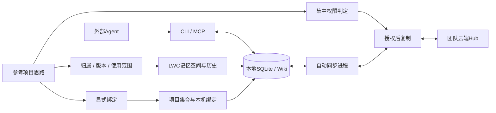

# TencentDB Agent Memory 参考评估

日期：2026-09-28。用户指定参考项目。检查默认分支 `feat/server_team` 的提交 `bd88cc83870bf9e7dbd2ec36aa13608d2295c7f4`，不是假设其默认分支叫 main。

结论：借鉴记忆治理、授权先于检索、显式选择记忆范围与配置式接入；不照搬模型代理、多服务和自动聊天蒸馏。用户明确要求LWC只提供Agent使用的环境与CLI/MCP工具，程序自主完成确定性功能，不内嵌Agent或接LLM API。LWC 首版的重心仍是全部核心持久记忆的本地优先安全协作。

## 1. 查看的依据

| 依据 | 本次实际核实范围 |
|---|---|
| [README](https://github.com/TencentCloud/TencentDB-Agent-Memory/blob/bd88cc83870bf9e7dbd2ec36aa13608d2295c7f4/README.md) | 产品组织、部署组件、可见性、资产绑定、按需检索；只作为产品说明，不等同于逐项实现验收 |
| [权限函数](https://github.com/TencentCloud/TencentDB-Agent-Memory/blob/bd88cc83870bf9e7dbd2ec36aa13608d2295c7f4/MemoryCore/src/metadata/service/permission-checker.ts) | 资源状态、owner、成员关系、visibility、角色默认值和ACL的判断顺序 |
| [固定资产解析](https://github.com/TencentCloud/TencentDB-Agent-Memory/blob/bd88cc83870bf9e7dbd2ec36aa13608d2295c7f4/MemoryProxy/src/injection/injectors/tdai-fixed-asset.ts) | 限定资产类型、同团队检查、单请求缓存和数量上限 |
| [登录Provider注册](https://github.com/TencentCloud/TencentDB-Agent-Memory/blob/bd88cc83870bf9e7dbd2ec36aa13608d2295c7f4/MemoryPanel/src/panel/auth/provider-registry.ts) | 不同认证入口由统一Registry组织 |
| [认证服务](https://github.com/TencentCloud/TencentDB-Agent-Memory/blob/bd88cc83870bf9e7dbd2ec36aa13608d2295c7f4/MemoryPanel/src/panel/auth/service.ts) | 认证身份、会话与provider边界的局部代码；不据此断言所有OAuth方式可直接复用 |
| [LICENSE](https://github.com/TencentCloud/TencentDB-Agent-Memory/blob/bd88cc83870bf9e7dbd2ec36aa13608d2295c7f4/LICENSE) | 文件声明 MIT；GitHub API 的 license 分类为 NOASSERTION，不能只凭分类判断 |

未运行该项目，未验证 README 的性能数字，未做全面安全审计，本次不复制其实现代码。

## 2. 借鉴什么，如何落到 LWC

| 借鉴点 | LWC 落地 | 首版范围 |
|---|---|---|
| 知识有归属、版本和可用范围 | 空间所有权、资源revision、显式grant、提交审计 | 必须 |
| 权限规则集中实现 | 服务端所有读取/搜索/复制经过统一policy；已有本地副本离线可读 | 必须 |
| 先确定可用记忆再召回 | 先授权订阅并形成本地副本，常规召回只查询明确绑定的本地空间 | 必须 |
| 按对象类型过滤，避免无关内容占满分页 | Wiki/时序记忆/Discussion/Todo/Plan等类型过滤在查询层执行；复制仍覆盖整个空间核心记忆 | 必须 |
| 记忆使用有数量预算 | 空间扇出、结果条数、字符数、请求超时有界 | 必须 |
| 多认证入口与内部账号分离 | 邮箱/飞书/GitHub → identity → LWC user/session | 必须，但三个具体适配器足够，不做可插拔认证市场 |
| 控制界面管理共享边界 | Web显示空间、成员、来源、修订、任务状态 | 必须 |
| 多层聊天记忆与模型代理 | 不符合本产品的工具优先原则；LWC不调用模型 | 不采用 |
| Agent资产装备 | 项目绑定和空间选择通过CLI/MCP提供给任何Agent | 不建立Agent运行平台 |

上表里 LWC 的实现是本设计提案，不是腾讯项目已有能力的逐字映射。

## 3. 不能直接搬过来的默认行为

检查的权限函数先判断 owner，再检查团队成员；restricted 分支对 admin 有不同处理。这是可见的代码顺序，但仅凭一个函数不足以判定整体产品是否存在漏洞，因为上游还可能检查账号或清理资源归属。

LWC 的需求已经明确为“空间显式授权、默认不可读”，因此采用不同的可测试规则：先校验账号、当前成员状态，再判断显式空间授权；历史创建者和团队管理员不直接绕过它。离职成员、管理员无grant、集合关联但无grant，均列入反向测试。

固定资产解析里的“同团队、限类型、限数量”值得复用为设计原则；其降级到个人资产的行为不能机械照搬到 LWC 远程写入。LWC采用本地优先：本地提交成功、远端不可用时保留pending并自动重试，不能标记成团队已确认，也不能偷偷换到另一个空间。

## 4. 对架构的实际影响

设计没有引入它的服务拓扑、存储实现或专用模型代理。每成员保留SQLite/Wiki，复用既有Sync三方合并；参考项目的云端注入不替代本地复制。既有 LWC CLI、SQLite、Agent协议和来源体系继续是基础；参考项目用于检验产品边界和遗漏，不作为 fork 起点。
