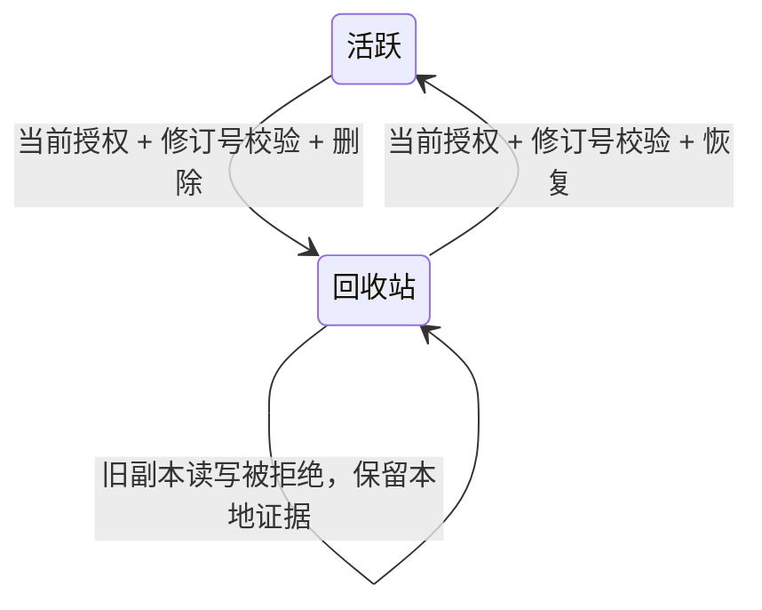

# 团队与空间删除恢复（v0.19.5）

2026-10-07 实现并验收。对应待办 `6b44b5286b1372eba741ac335f737753`、计划 `95ca7ea798bbf68ca5a29b6ea70e6e7b`。下述能力已随 v0.19.5 发布；生产 8788 仍运行 0.19.4，本次发行没有部署生产。完整发行证据见 [v0.19.5 验收](../releases/v0.19.5-acceptance.md)。

## 用户路径

后台「资源管理」显示当前可管理的团队和空间，以及按当前权限筛选的回收站。删除先读取服务端最新名称、修订号和受影响空间数量，再以现有 shadcn/ui 弹窗确认；无需输入内部标识或转抄名称。取消及 Escape 不改变资源。确认后刷新团队、空间选择和回收站；没有可访问空间时，回收站仍然可达。

恢复也先读取最新预览并明确确认。中文与英文的名称、日期、确认文本及结果提示一致随语言切换；资源名和记忆正文不翻译。



## 授权与数据保全

| 对象 | 删除、查看预览与恢复权限 | 数据处理 |
| --- | --- | --- |
| 团队 | 当前有效账号且仍为团队所有者 | 仅将当时活跃的团队空间移入回收站 |
| 空间 | 当前有效账号、管理者授权与当前团队成员资格；个人空间沿用所有者关系 | 保留原始 Store、来源、页面、全部核心记忆和同步材料 |
| 回收站列表 | 当前所有者或当前空间管理者 | 不返回无权限对象，固定查询每页最多 100 条 |

删除状态存储在控制库 schema 7：团队 `archived/deleted_at`，空间 `archived/deleted_at/archive_team`。`archive_team` 区分随团队删除的空间与先前独立删除的空间。团队恢复只恢复前者，后者仍在回收站。团队已删除时，必须先恢复团队才能恢复其空间。

不物理删除记忆、不清空本地副本、不撤销现有成员或空间授权，不抹掉项目/集合关联。恢复按当前授权重新开放，不恢复历史权限快照。团队删除使所有尚未使用的旧邀请失效，恢复不会重新启用它们。个人登录身份仍然存在，可管理其他资源。

## 管理接口与并发

`POST /api/manage` 支持 `team.delete.preview`、`space.delete.preview`、`team.delete`、`space.delete`、`team.restore`、`space.restore`。参数为 `team_id` 或 `space_id`；四种修改动作要求 `expected_revision`。修订号不符返回 409，客户端重新读取预览；使用当前修订号重复请求同一目标状态返回 `unchanged=true`，不追加审计或修订。删除/恢复成功各产生一条活动记录。

`GET /api/admin?view=trash&offset=0` 返回授权后的分页回收站。团队删除时不单独展示其子空间；团队恢复后，独立删除的空间重新出现在空间回收站。

删除状态由所有空间操作共用的中央授权检查拒绝。已关联用户收到 HTTP 410（`space_deleted` 或 `team_deleted`），无权限外部账号仍只得到权限拒绝。读取、上传和发布都不能绕过。正在准备的发布在最终事务屏障重新校验授权；删除先提交时，旧发布不得改变内容、head、身份或回执；发布先提交时，其已完成数据保留，再执行删除。

## 本地副本与智能体通知

客户端获知 410 后暂停正常共享写入；原有 SQLite、正文、基线、未发送内容及暂存证据保留。`replica.resource.deleted` 通过下一条 CLI/MCP 响应和原生 Hook 提醒智能体保全数据，不重建资源、不绕过权限。Hook 将其作为状态提示，`completion_effect=none`，不会把它包装成必须反复合并的冲突。

现有同步工作进程继续按重试节奏检查；授权恢复后，正常获取新签名策略并合并未确认内容。恢复不清空 outbox，不重置固定公钥，不伪造已同步确认。CLI 验收证明恢复后的旧正文、未发送内容及后续新增内容均正确回到云端；本次未另行测量后台自动重试的传播延迟。

## 升级与回退边界

schema 1 和原公开 0.19.4 的 schema 6 均通过迁移测试，原有账号和团队保留。迁移事务失败不得留下部分列或版本号。控制库迁移至 7 后，旧 0.19.4 服务端不能直接读取它。正式部署前必须使用旧版本停服备份、保留旧程序/管理端制品并记录回退窗口；不得只替换为旧二进制后强行降低版本号。

现有灾难恢复接口要求当前 `authority-data` 并保留当前控制库，因此不会从旧记忆备份重新启用已删除状态。这项路径由源码合同确认；本次未重新跑灾难恢复矩阵。永久清除与保留期限不在本次实现范围内，不能把回收站恢复等同于备份恢复。

## 针对性验收

Rust 编译、测试、格式和 Clippy 均在 Pro 的隔离源码目录完成；普通安装未改变。没有操作生产业务数据。

| 检查 | 结果 |
| --- | --- |
| `cargo test --locked --bin lwc team:: -- --nocapture` | 8 项通过，包含 schema 1/6 迁移、生命周期、现有 HTTP 同步及并发发布 |
| 在途发布授权竞争 | 撤权、空间删除、团队删除三种分支均拒绝旧发布，原始内容/身份/head/回执不变 |
| Hook 信号目录固定优先级单项检查 | 通过 |
| `cargo fmt --check`、`cargo clippy --locked --bin lwc -- -D warnings`、候选构建 | 通过 |
| 管理端 TypeScript/Vite 构建、`npm test --prefix admin` | 通过，409 个界面词条完整双语，记忆正文保持原文 |
| 隔离服务真实 HTTP/CLI 旅程 | 下列 15 组断言通过 |
| 系统 Chrome | 登录、Escape 取消、空间删除/恢复、团队删除/恢复、删除后回收站可达、独立删除保留、英文恢复、结果提示切回中文、退出登录通过 |

可重复验收脚本：`tests/team_lifecycle_acceptance.py`，仅接受候选二进制和管理端构建目录，自行创建临时服务，不接受既有业务服务地址。

```sh
python3 tests/team_lifecycle_acceptance.py /path/to/candidate/lwc --assets /path/to/admin/dist
```

15 组 HTTP/CLI 断言覆盖：只读成员拒绝；CAS 与同状态重试；删除后读/提交拒绝；本地内容保全与写入暂停；恢复同步与正文/head；团队级联及独立删除；回收站授权；旧邀请持续失效；项目关联保留；未发送内容保留；恢复后新写入；CLI 与 Codex 原生 Hook 删除状态提示；跨团队管理拒绝及删除后其他团队持续可用；空间集合变化使团队旧确认失效；已删除空间管理权限交接和成员移除。无 `--keep-for-browser` 时，成功结束会停止临时进程并删除私有测试凭据和目录；保留模式仅用于随后浏览器验收，结束后须清理。

## 审查修复验收（2026-10-07）

本节关闭对初始候选 `c311790` 的四项审查发现；修复已随 v0.19.5 发布，尚未部署生产。

- 空间创建、独立删除和恢复在同一事务中递增所属团队修订号，旧团队删除预览不能误删后来新增或恢复的空间。
- 已删除资源允许当前空间管理者执行授权交接或撤权，当前团队所有者可以移除成员；保留当前成员资格、最后所有者和最后管理者检查。普通记忆访问仍拒绝，不必先恢复数据访问再处理离职成员。这里补齐管理接口，不新增归档权限管理面板。
- 同步任意阶段收到 401/410 或空间级 403 都通过统一失败出口暂停本地共享写入；单条记忆的细粒度 403 只禁止对应操作，其他已授权写入保持可用。原始内容和未发送记忆继续保留。
- 弹窗内显示失败原因并禁用旧确认；用户点击“重新查看”取得新预览后才能确认。

Pro 默认构建、Clippy、8 项团队测试和 15 组真实 HTTP/CLI 断言通过。另用 `sync-fault-injection` 构建运行同一脚本并加 `--fault-injection`：在成功读取 head 后、上传前暂停，删除空间，再恢复同步，验证 410 当即暂停后续本地写入，原有待发送内容保留且恢复后可同步。默认构建不包含此注入能力。

系统 Chrome 实测：打开影响 3 个空间的团队删除弹窗后，在隔离服务创建第四个空间；旧确认返回冲突，提示在弹窗内可见，确认按钮禁用。“重新查看”后数量更新为 4，确认重新启用；取消并退出登录。测试服务、隧道、私有测试凭据和临时数据已清理，生产未变更。

发布门禁补充：完整团队 CLI 集成首次发现细粒度 403 被误当作整空间撤权；服务端资源拒绝现明确标注范围，客户端保留其他已授权写入。原测试继续验证禁止页被拒绝、独立允许页可写，不放宽断言。
