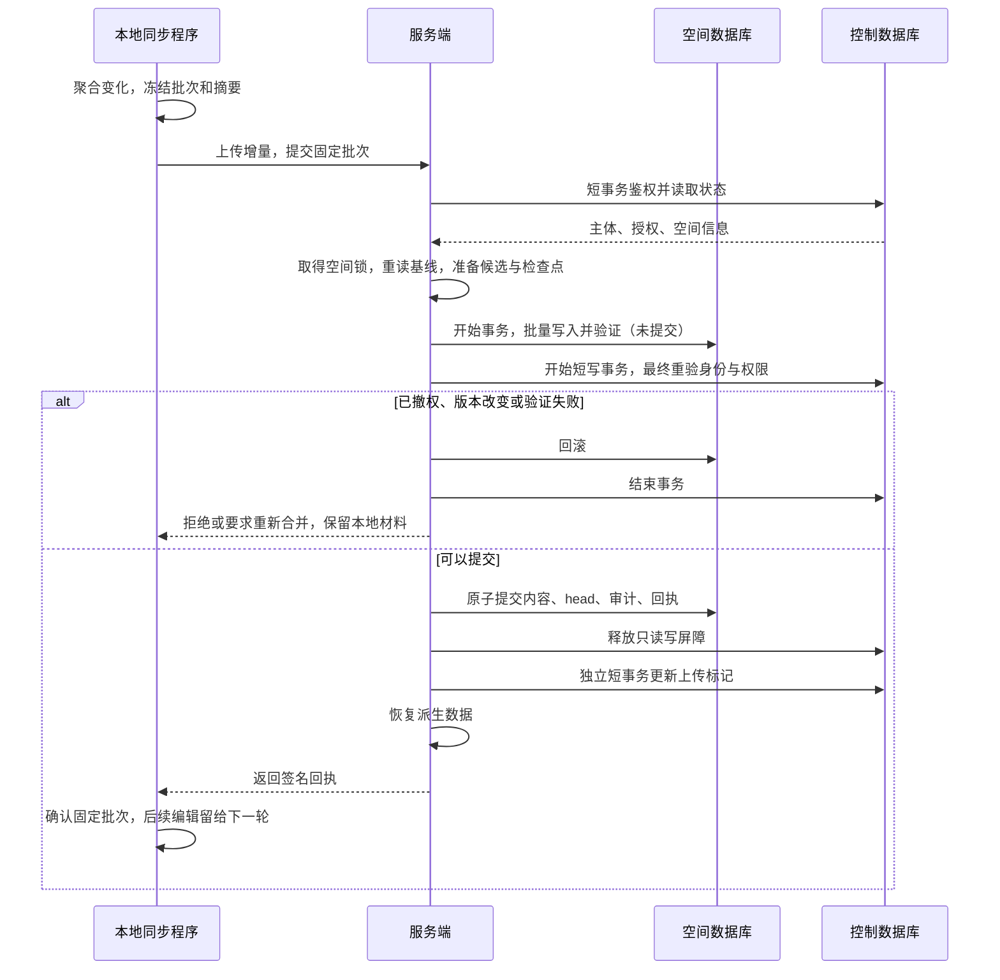
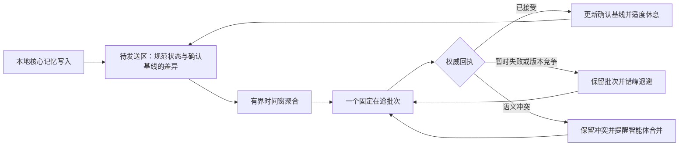
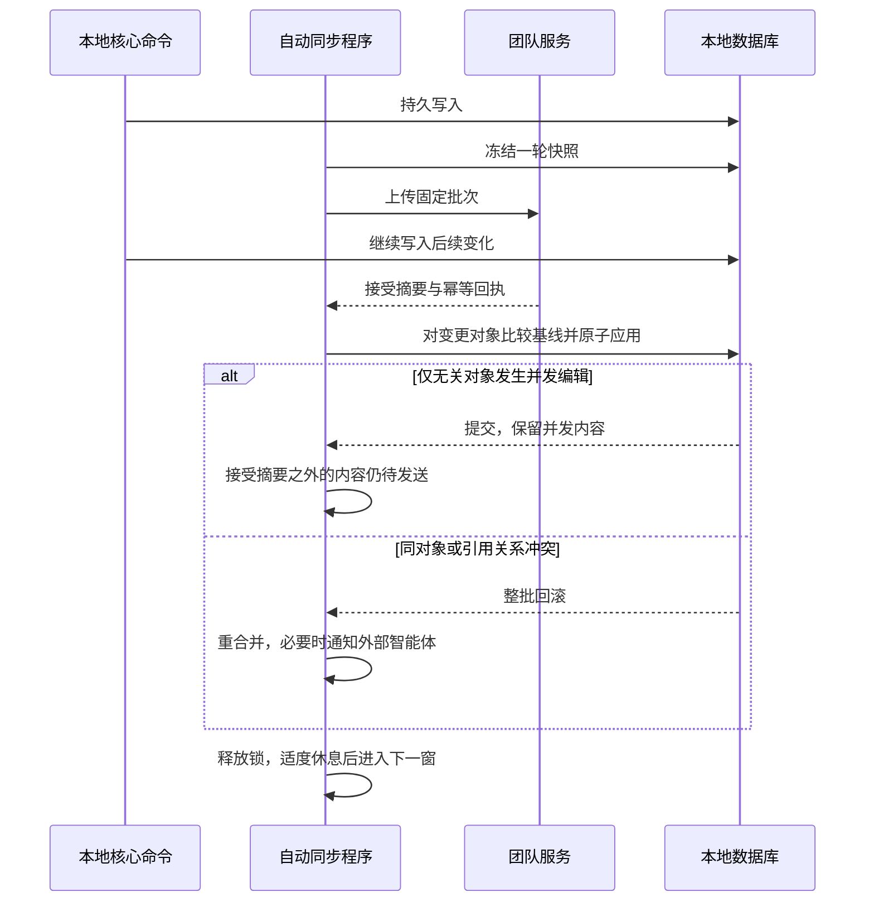

# 团队同步可用性修复方案

日期：2026-10-06。本文记录修复设计与实施合同。用户已于本日授权开始实现及独立部署验收；实际制品、测试覆盖和现网状态以验收报告为准，隔离验收不等于8788已升级。

执行计划：`d9eeb6e56e4aa4e47e2665283e74cbcc`（`lwc --scope project plan brief d9eeb6e56e4aa4e47e2665283e74cbcc`）。

## 1. 结论与范围

采用“窗口聚合 → 固定批次 → 锁外准备 → 空间内串行写入 → 最终授权检查 → 原子发布”。先修复逐条落盘，再缩短全局控制库写锁。继续使用 SQLite、现有增量传输、批次回执和恢复检查点，不新增消息中间件、不改变核心记忆同步范围、不内嵌模型。

批量化不等于把同一个逻辑版本拆成多个对外可见版本。页面、来源、引用、计划、待办、时序记忆及审计可能互相引用，必须一起通过领域约束并发布。首版保持一次逻辑批次对应一次 head；大文件流式处理，临时输出采用显式事务，不按任意对象数反复提交 live Store。

## 2. 制定方案时的证据与待验证事项

本节保留实施前基线，不代表最终候选仍有长写事务；实施后结果见验收报告。

- 用户提供的事故报告：v0.19.3 首次全量接受 148 页面、65 来源，head=1；后续增量超时、管理接口 database_busy。未在本次工作中连接事故服务器核实实时状态。
- 已核对源码：完整导出与恢复清单共用 `src/store/sync.rs::export_sync_objects`，原先逐对象隐式提交；`src/team/hub.rs::space_operation` 从鉴权至快照准备、发布、衍生索引完成均持有控制库 IMMEDIATE 事务。
- `/push` 原先沿用客户端 30 秒超时，上传已有 600 秒；超时不证明服务端未接受请求。
- 工作树已有补丁：两种导出共用一个显式事务，失败回滚；提交超时调整为 600 秒。持久化等级未降低，未解除授权锁。
- Pro 对照：4500 来源的完整导出 1.877→0.218 秒，清单 0.882→0.080 秒；单轮数据，只证明本机改善。故障注入旧实现留下 2 条部分对象，新实现回滚到 0。
- Pro HTTP 回归：148 页面、65 来源和审计共至少 4500 对象，之后新增一页，提交约 0.548 秒；并发控制库写入、重复提交、旧 head、撤权拒绝通过。大来源导出检查及完整 `team_cli` 通过。
- 仍有全局长事务；大空间和慢盘下的管理可用性尚未解决。旧 HTTP 的4500来源压力夹具曾超过10秒，并不等同于4500混合对象；不能把快速混合夹具当作任意规模性能保证。

## 3. 批次与压力控制

| 层次 | 本轮设计 | 保全规则 |
| --- | --- | --- |
| 本地聚合 | 复用默认 2000ms 的可配置周期及持久基线；普通启动先聚合一窗，成功后按工作耗时适度休息再处理变化 | 不按每次编辑建立快照任务，不等待永远不会到来的“完全静默”；周期不是端到端延迟保证 |
| 并发 | 每空间最多一个在途批次；自动与手动入口共用已有副本锁 | 忙时返回可重试状态，不另造批次 |
| 批次冻结 | 复用持久化 pending、batch/request ID、基线及摘要 | 批次冻结后新增编辑进入下一轮，不更新已上传批次内容 |
| 数据库导出 | 同一临时清单/快照一次显式事务，复用流式 blob 路径 | 失败丢弃临时产物，不能发布部分清单；不关闭 fsync |
| 网络传输 | 复用现有增量制品和尺寸限额；无需逐对象 HTTP | 中断保留待同步材料；超限明确报错，不静默省略核心类型 |
| 重试 | 保留指数退避，增加有界随机抖动；尊重服务端重试提示 | 不同客户端避免同时重试；不重置固定批次身份 |

本轮不新增“每500条写一次远端版本”的参数。对象数不能反映正文大小，任意拆分还会破坏引用闭包。只有后续测量证明单制品尺寸成为瓶颈，才设计可续传传输分块：各块摘要校验并暂存，全部到齐后仍一次发布；这是传输分块，不是领域状态分块。

空闲周期仍可能发 head/确认请求；“跳过导出”不表示完全无网络或无控制库写入。先拆只读路由和短元数据事务，测量后再决定是否增加条件请求/确认去重，不叠加另一套调度器。

## 4. 消除全局长写锁

### 4.1 安全边界

控制库是身份、会话、设备、委托和空间权限的权威；空间 Store 是核心内容、head、批次回执和接受审计的权威。两库不存在一个可凭空依赖的跨库原子提交。最终授权检查必须与空间权威提交串行于撤权，不可仅相信准备阶段权限或未过期客户端租约。

### 4.2 发布分阶段

1. **入口检查与固定输入**：短读事务验证实例门禁、真实主体、空间权限、上传归属和协议；固定空间 epoch/head、基线摘要、批次身份与上传摘要。权限读取结束即释放事务。
2. **准备候选**：空间写操作使用跨进程文件锁串行化。锁在空间目录，复用 std 文件锁能力，进程退出自动释放。网络上传不持空间锁；获取空间锁前不持控制库事务。取得后重读 head；重建候选、校验完整性、检查配额、保存恢复点、计算真实差异均不持控制库写锁。
3. **准备空间写入**：拆分 `publish_sync_state_inner` 的准备/写入/提交/衍生处理。打开空间库事务，批量导入、领域约束检查和接受记录准备均尚未提交；以预期 Store identity 再校验，失败回滚。这一阶段可以耗时，但只占该空间写入，不占控制库写锁。
4. **最终提交屏障**：空间事务准备完成后才开启短控制库 IMMEDIATE 事务。重新验证会话、用户、设备、委托、空间授权/策略、epoch、上传状态及批次绑定。策略校验使用服务端已验证且摘要绑定的实际差异，不信任客户端动作标签。若相关状态改变，回滚空间事务并重新准备/拒绝；不可继续用旧授权。实例门禁在请求入口校验；轮换门禁阻止新请求，不追溯撤销已经通过门禁的请求，正在进行的提交仍受最终主体与空间授权检查约束。
5. **原子发布**：持有控制库屏障时提交空间事务；核心内容、head、批次回执和权威审计同事务落盘。释放只读控制写屏障后用独立连接更新上传标记；空间权威回执用于补齐标记，标记失败不能撤销已接受内容。签名响应、清理上传文件、Markdown/图索引重建不占控制库锁。
6. **完成派生数据**：记录可恢复的索引任务；读接口不得把旧索引误称为新 head 完整结果。复用既有 derived 状态；未完成时明确提示或读权威路径，重启可续做。

准备对象只能由服务端构造，绑定基线、候选摘要、身份、epoch/head 和授权所需的变更集合。不得暴露一个允许调用者任意跳过验证的通用提交接口。

### 4.3 锁顺序与所有入口

统一锁顺序：**空间文件锁 → 空间事务 → 短控制库写事务 → 空间提交 → 释放控制屏障 → 独立更新上传标记**。禁止其他路由在已持控制库写锁时等待同一空间锁或空间写事务，否则产生反向死锁。

必须一起审计普通 push、首次初始化、补偿恢复、epoch 恢复、管理端空间写操作及授权辅助函数。权限管理只更新控制库，不能在持锁时进入空间库等待写锁。无法满足该顺序的入口必须先改造，不能先发布局部解锁版本。

只读 head/receipt/query 使用短授权读事务及一致WAL快照；pull 的下载准备仍使用空间锁串行，但不持全局控制写锁。首次空间初始化从普通读路由移出；快照在传输期间被固定，清理不得删除在用文件。撤权后的新请求必须拒绝，已开始传输的字节无法收回；严格原子撤权边界针对写入提交。

控制库仍是 SQLite 单写者；最终 fsync 仍可能慢。本方案消除的是与全量导出/导入时长绑定的全局写锁，不承诺任意坏盘下零延迟。若最终提交本身持续超标，另立架构升级，不能通过降低持久化或跳过最终鉴权解决。

## 5. 超时、崩溃和清理

| 故障点 | 权威结果 | 恢复动作 |
| --- | --- | --- |
| 候选准备失败/磁盘满 | head 不变 | 保留原记忆及待同步输入；只清理能证明归属的临时产物 |
| 空间事务写到一半退出 | 空间事务回滚 | 重试相同批次，重新验证当前权限 |
| 空间提交成功，控制库标记尚未提交 | 空间回执已经权威生效 | 用同一批次查询回执，修复上传状态；禁止重复推进 head |
| 服务端已提交，响应丢失 | 客户端结果未知 | 查询既有回执；未找到不等于确定未提交，重试沿用原身份 |
| 派生索引失败 | 权威内容已提交 | 回执区分接受与索引状态；从持久任务继续重建 |
| 准备期间撤权 | 不得接受新写入 | 最终检查拒绝并回滚空间事务，本地未同步材料保留 |

`/push` 的600秒只是长操作兼容上限，不是完成标志。确认旧 pending 的回执前不能新建逻辑批次。终态清理只能在空间权威回执确认且不影响活跃读者后进行；上传状态仅为可重建的辅助状态。

保留现有恢复点，不把每次安全检查点无限永久保存。此次只核对既有保留/配额策略与新暂存生命周期，不顺便自动删除历史数据或改变保留政策。

## 6. 最小编码顺序

| 阶段 | 主要文件 | 交付 |
| --- | --- | --- |
| A 批量事务热修复 | `src/store/sync.rs`、`src/replica/engine.rs`、既有测试 | 已有补丁复核；格式、故障回滚和原路径回归 |
| B 分离准备与提交 | `src/store/sync_publish.rs`、`src/store/team_publish.rs` | 可验证的准备结果、受控最终检查点、同库原子接受、派生任务恢复 |
| C 分离空间操作与授权屏障 | `src/team/hub.rs`、`control.rs`、`policy.rs`、`recovery.rs` 及调用者 | 跨进程空间锁、统一锁顺序、读写路由分离、撤权竞争安全 |
| D 聚合与重试收尾 | `src/replica/daemon.rs`、`engine.rs` | 保留周期聚合，补齐带抖动退避和同批次不确定结果恢复 |
| E 真实验收与交付 | 既有 Store/HTTP/CLI 测试、团队验收文档与部署说明 | Pro 定向测试、隔离容器、正式制品及事故实例回读分开记录 |

A 可独立作为缓解版本，但不能宣称全局锁问题关闭。B/C 必须成套审查；预期不迁移数据库结构、不改变网络协议。若派生任务的持久状态无法复用现有结构，先明确最小迁移与旧版回退边界再编码，不隐式扩展。

## 7. 针对性验收与放行

不跑无关矩阵。Rust 编译测试只在 Pro；沿用现有 Store、HTTP、team_cli 测试补最少场景。先记录导出、准备、空间锁等待、控制锁等待/持有、提交、派生重建的独立耗时，日志仅记录摘要/关联 ID，不记录正文或凭据。

1. **原规模路径**：148页面、65来源、至少4500混合对象；全量后新增一条并从第二客户端读取，核对摘要、head、审计及原对象保留。覆盖所有核心类型的既有往返仍必须通过。
2. **确定性慢准备**：在准备阶段放置测试屏障而非依赖磁盘碰巧慢；保持至少超过原5秒busy期限。此时另一个空间的提交及控制库管理操作能在屏障释放前完成；同空间写操作有序且不丢写。
3. **撤权竞态**：在最终授权屏障前暂停，撤销用户/设备/委托或收紧策略，再继续；必须拒绝且head不变。反向次序则提交先完成、随后撤权生效，回执可解释，不接受模糊结果。
4. **不确定结果**：丢响应、提交前退出、空间提交后但控制标记前退出；重试同batch只接受一次，旧版基线和本地后续写入不被覆盖。
5. **持续编辑与压力**：有限持续写入期间每窗口聚合，无并行在途批次，无永远等待静默；网络恢复后完整收敛。已有较重4500来源夹具作为单独性能诊断，计时单独报告，不与4500混合对象混称。
6. **失败与恢复**：导出故障整批回滚；一次磁盘写入失败不推进head；补偿恢复与普通push使用相同锁顺序。索引失败重启恢复不重放已接受内容。

普通 Pro 混合夹具增量目标保持2秒内；这是验收目标，非生产承诺。架构放行以确定性屏障测试证明管理操作与慢准备解耦为主，不用任意睡眠耗时断言替代并发正确性，也不以提高timeout掩盖阻塞。

## 8. 部署与回退步骤

1. 发布前核对实际镜像/二进制摘要、待接受批次及空间head；备份控制库、空间库、快照、恢复材料，使用既有一致性备份流程，不热拷贝孤立的SQLite主文件。
2. 先用相同容器存储方式的隔离实例验收；当前生产数据不作为可随意写入的压测夹具。
3. 正式上线时避免两个不同锁协议的服务端版本共用同一数据目录，采用短维护窗口替换；实例范围和授权按实际部署要求核对。
4. 部署后首先查询旧 pending 的回执并读回原148页面/65来源及实际新增内容，再恢复暂停的自动同步。以最终摘要、客户端收敛和正常管理操作判定恢复，不能只看容器健康。
5. 出现问题先停止新写入并保留全部材料。若没有schema变化，可回退程序但保留最新数据；不得把事故前备份直接覆盖已接受的新记忆。确需恢复数据走已审计的补偿/灾难恢复路径，单独核对影响。

## 9. 设计依据

SQLite 隐式事务在语句完成后提交、同一数据库仅支持一个并发写事务，因此合并事务可以减少细碎提交，但仅改WAL不能解决全局长写锁。[SQLite事务文档](https://www.sqlite.org/lang_transaction.html)

WAL支持读写并行，但多库事务不能自动获得跨库整体原子性；本方案把空间回执作为权威、上传状态作为可修复辅助记录。[SQLite WAL文档](https://www.sqlite.org/wal.html)

持久化与崩溃恢复边界按SQLite原子提交机制处理，禁止为了性能关闭日志或可靠落盘。[SQLite原子提交文档](https://www.sqlite.org/atomiccommit.html)

## 10. 已授权的真实环境验收计划（2026-10-06 补充）

用户已授权在 `https://10.10.10.17:8788/` 创建专用测试空间，并可在 `zd@10.10.10.17` 单独部署修订实例，进行压力、极端和真实端到端测试。随后用户已明确要求开始实现，现按此授权执行独立部署和测试，范围内无需重复请求许可。

该授权不包含替换现有8788实例、破坏业务空间、主机级断网/填盘/重启、删除既有数据或公开发布。共享主机上的资源压力必须受限。正式替换现有服务作为独立放行项，不将隔离版本验收通过等同于现网升级完成。

管理员身份仅用于创建本轮资源和授权；测试客户端使用程序生成的专用用户、设备与最小权限凭据。用户提供的密钥不进入方案、Wiki、计划、源码、命令参数、录像或日志。执行时用标准输入或权限受限的临时凭据文件；报告仅记录角色和测试主体别名。实例门禁Token与用户密钥是不同凭据；源码支持有效个人密钥通过入口门禁，验证时按真实合同使用，不能伪造管理员身份。独立实例生成自己的凭据，不能复用生产密钥作为测试负载。

### 10.1 环境与隔离

| 环境 | 用途 | 允许的操作 |
| --- | --- | --- |
| Pro | Rust编译、单元/集成回归、打包 | 使用隔离源码与构建缓存；记录提交、编译目标和制品摘要 |
| 现有8788实例 | 真实入口、TLS、管理界面和现有版本行为核对 | 专用空间内小流量功能测试；不做故障注入、不制造大量锁竞争 |
| 独立旧版实例 | 同机、同资源限额的对照基线 | 合成数据复现旧版，不对业务实例运行压力基线 |
| 独立修订实例 | 完整修复验收 | 多客户端、压力、断连、限速、进程退出、恢复测试 |

执行前先只读盘点SSH可达性、主机架构、运行时、空闲端口、磁盘、现有卷/容器和资源使用。选择未占用端口；独立容器/进程、数据目录、网络、日志和凭据，绝不挂载业务数据卷。固定项目名/目录前缀 `lwc-sync-qa-<run-id>`，所有资源登记在清单中，重跑只复用或回收清单证明归属的测试资源。

旧版与修订版使用相同合成输入、持久化选项、资源预算和测试驱动，分开运行，避免同机相互争抢造成错误比较。Rust编译与cargo测试继续在Pro进行；目标机只运行与其架构匹配的制品、容器及外部测试驱动。目标平台交叉构建不可用时明确记录构建阻塞，不把macOS二进制复制到Linux伪装部署完成。

HTTPS验证使用经过核实的服务证书/CA进行精确信任，不全局关闭证书验证。修订实例默认仅回环地址或受控网络可达；远端真实客户端通过SSH转发或已有受限入口连接，不扩大服务暴露面。

### 10.2 真实用户旅程

1. 管理员创建测试空间、只读用户、编辑用户、管理用户、受限智能体；验证邀请加入和密钥登录，未授权空间默认不可见。
2. 客户端A用CLI写入，客户端B使用独立目录及身份自动接收；MCP读取相同结果，后台管理界面展示相同版本。首轮全量、后续单条增量、连续编辑分别验证，不能只绕过客户端调用内部函数。
3. A/B并发编辑：不冲突字段和独立新增自动合并；同一语义对象产生冲突时，验证Hook/下一条命令提醒，测试外部智能体通过正常CLI/MCP读取材料并提交合并。无人值守期间只保全冲突，服务端不得自行调用模型或悄悄选边。
4. 覆盖页面、来源/blob、引用、关系、时序记忆、计划、待办、讨论、领域历史、草稿意图和终态审计；用稳定对象身份与规范化摘要比较，不以页面数量相等代替全核心一致性。插件数据、凭据和本机活动执行权不能泄漏。
5. 云端只读客户端不创建本地副本；受限用户在正常CLI写入时被阻止，篡改请求绕过本地守卫仍被服务端拒绝。测试只读、对象级限制、压缩/替代限制、账号/设备/智能体撤权。
6. 浏览器验证空间切换、同步/错误状态、正文链接、分享链接鉴权；错误提示不得宣称未确认批次已成功，也不得让用户手工修数据库。
7. 在专用空间做补偿恢复，验证恢复记录向A/B传播，保留无关后续编辑。独立实例做一致性备份→新目录恢复→客户端继续同步。

邮件验证码、飞书和GitHub外部真实登录继续按用户先前要求豁免，本轮不宣称通过；密钥登录必须真实验证。

### 10.3 压力矩阵与停止条件

以下为拟定档位，执行前按主机资源裁剪并记录实际达到的上限，不把未运行档位标为通过。

| 维度 | 档位 | 观察目标 |
| --- | --- | --- |
| 记忆规模 | 原型148页面/65来源/≥4500混合对象；约45000对象；资源允许再到100000 | 导出与准备增长趋势、内存与磁盘峰值；不能因对象多而阻塞其他空间 |
| 竞争方式 | 1、4、8个真实客户端；同空间与4个不同空间分别运行 | 同空间有序、跨空间可用、最终完整收敛 |
| 写入模式 | 单条、一次100条突发、每秒1次持续编辑10分钟 | 聚合效率、批次数与写入数之比、积压恢复 |
| 来源尺寸 | 多小文件、一个16MiB来源、逼近配置允许上限、略超上限 | 流式处理、内存有界、超限明确拒绝且head不变 |
| 稳定性 | 预热后每档5分钟；通过后30分钟持续混合读写 | p50/p95/p99、成功率、积压、临时文件增长及资源回收 |

先分开扫描数据规模和并发，再运行一个资源范围内的组合高档，不做所有维度笛卡尔积。旧版卡死或超过预定时限时记录为失败并停止该测试实例，不能无限等待。

拟定资源预算：根据空闲量限制独立实例CPU、内存和测试卷；默认最多使用当前可用内存的25%与逻辑CPU的25%，必须为既有服务留余量。测试文件预算不超过开始时空闲磁盘的10%，并保持主机至少20%磁盘可用；任一条件无法满足就降低档位或停止。限额须由容器/cgroup/测试卷等可执行机制落实；不能落实硬隔离时不进行填满磁盘或最大负载注入。

专用只读探针持续观察原8788服务：连续3次失败，或探针p95超过空闲基线2倍且超过2秒，立即停止本轮负载并记录；不能靠重启业务服务恢复。任何测试对象丢失、未授权接受、重复接受同batch、主机资源保护线触发，均立即停止升压并保留证据。

### 10.4 极端与故障注入矩阵

仅在独立实例/测试客户端执行；每个故障先保证一个正常基线，再注入、恢复、核对结果，不同时堆叠多个故障掩盖根因。

| 注入 | 方法边界 | 必须结果 |
| --- | --- | --- |
| 慢准备超过5秒 | 测试构建屏障，或独立实例限定I/O；不拖慢主机盘 | 其他空间提交与管理操作在释放屏障前完成 |
| 上传中断、截断、重复、校验错误 | 测试代理/客户端 | 部分产物不发布；摘要失败拒绝；重试不重放 |
| 提交响应丢失/乱序/延迟 | 仅测试代理丢弃返回 | 原batch回执确认一次；不能把新本地编辑计入旧确认 |
| 断网后持续本地写入 | 仅隔离网络或测试客户端代理 | 本地可写；恢复后收敛，无静默覆盖 |
| 关键点退出 | 仅杀测试服务进程；提交前、空间提交后控制标记前、响应前 | 重启后旧/新状态二选一且完整；回执能解释接受状态 |
| 磁盘满/只读/写入错误 | 有硬上限的专用测试卷或故障注入；不填满宿主机 | 明确失败，原权威内容完整，修复存储后可继续 |
| 撤权/角色变更/设备与委托撤销 | 准备与最终提交之间设置屏障 | 先撤权则提交被拒；先提交则撤权对后续请求生效 |
| 同批次并发、旧head/旧epoch、同ID不同摘要 | 两个测试客户端请求 | 仅一次接受；冲突/过期拒绝，不能串空间或串主体 |
| 畸形制品与边界值 | 截断SQLite、未知对象类型、坏引用、超配额、恶意路径 | 验证失败关闭，禁止越界读写，不产生半成品版本 |
| 补偿与推送竞争、索引失败 | 测试空间并发和测试构建故障点 | 无反向锁死；已接受内容不因索引失败丢失，重启可恢复 |

测试屏障/故障点必须只存在于测试构建或测试驱动；正式制品不得有可远程触发的故障接口。完整故障矩阵可以使用测试构建；最终交付制品另跑无注入端到端和重启持久化，记录两者摘要，不能混称同一制品。

### 10.5 判定、证据与交付

正确性红线：全核心对象及语义引用无丢失；撤权后无未授权新提交；同batch至多接受一次；已接受版本可完整读回；恢复不覆盖无关编辑；凭据不进入共享记忆/日志。遇到预期错误必须核对错误分类和权威状态，HTTP非200不必然是测试失败，200也不必然是通过。

最初提出的时延观察目标为单条增量确认p95≤2秒、后台管理请求p95≤1秒、自动传播p95≤5秒。2026-10-07用户明确修正：首次同步大是正常现象；主要验收平缓的同步队列和适度成批，耗时数字不单独决定通过。保留原测量及失败记录，不能事后把尚未完成的组合负载算作通过。重点核对本地操作和管理操作受影响程度、资源占用、批次聚合、持续进展、停止写入后的积压消化以及故障恢复。过载时主动退避允许较长传播时间，但不能无限积压或反复制造无效工作。

验收报告保存于 `docs/team-cloud/sync-availability-acceptance.md`，执行后创建。内容包括源码提交、构建目标、镜像/二进制摘要、环境与资源预算、数据种子及对象类型计数、逐场景结果、延迟分位数、错误分类、最大积压、收敛摘要、崩溃前后回执、剩余限制和实际覆盖范围。关联日志脱敏，用户密钥和真实业务正文均不保存。

“通过”仅指记录的版本、环境、负载和故障矩阵；不能承诺数学意义上的所有情形绝无问题。测试失败先修复再重跑失败场景及受影响回归，不无条件反复运行全部矩阵。

完成后停止负载与测试专用进程，保留可供用户查看的独立修订实例、必要测试空间和证据；临时资源只按清单处理，不自动删除业务数据。公开发布和替换8788业务服务分别记录，未获本次范围授权前不执行。

## 11. 持续编辑与竞争验收追加修复

本地导出改为独立一致WAL读快照，SQLite后续写入不使已冻结窗口失效；外部草稿材料仍做指纹校验。普通新编辑进入下一批，仅已被服务端拒绝且已修复的批次在上传前重建。若接受摘要等于本地冻结快照，内容已经存在本机，直接确认基线而不重复导入；后续本地编辑通过未确认identity留给下一轮。收到其他客户端内容仍需实际合并、校验及本地原子应用。

完整快照与空快照共用初始化，表结构和清单头同事务创建，减少慢盘下固定开销；空闲轮询仅在角色或服务端公钥发生变化时重写副本记录。保留签名权限续期、确认请求和故障状态持久化，不降低落盘等级。

已确认旧head且无接受回执的候选，丢弃活跃指针前通过服务器中止自己的上传预留；本地证据保留。这样重复版本竞争不会占满四个在途上传名额。派生索引的临时失败可重试完整恢复，成功后清除旧失败状态；超过64MiB索引上限的来源仅在head变化后重试，不在同一版本反复消耗资源。

压力档位按实际共享主机预算裁剪：4500/45000对象；4、8客户端和4空间；100条突发与10分钟连续写入。100000对象、30分钟额外稳定性以及全部输入尺寸的笛卡尔积不自动计为已运行，最终报告逐项列明覆盖。

## 12. 平缓同步队列（2026-10-07）

复用本地规范数据库、已确认基线与持久化pending，不另建逐编辑快照队列。未确认的规范状态就是待发送区，时序事件与审计仍保存在规范数据库中，不因合批删除。每空间只有一个在途批次；确认前保持固定摘要、batch/request身份，后续编辑累计在本地，确认后进入下一窗。首次大基线仍整体校验和原子发布，网络流式传输不等于分批发布领域状态。

自动程序普通启动等待一个配置周期以收集突发编辑；已有active批次则立即查询回执、继续恢复。聚合窗口不会因每次编辑重置。成功后等待 `max(配置周期, min(本轮工作耗时, 60秒))`，再加最多10%且不超过5秒的正向随机错峰。这样慢盘上不会每完成一轮就立刻准备下一轮，期间编辑自然合批。手动同步仍可立即执行，共用副本锁；等待期间不持同步锁或数据库事务。

错误和正常版本竞争都进入有界指数退避，采用75%–100%随机错峰且不短于配置周期；不重置持久批次。不变的worker状态仅每分钟写一次心跳，状态变化立即写入；回执、pending及基线仍按原持久化要求保存。worker报告时间是最近落盘心跳时间，不能解读为每次网络检查时间。

这次追加仅改变自动调度与非权威心跳刷盘，未消除单批内部全量快照开销。每空间任务数不会随编辑次数增长，但未同步数据量、保留的历史材料及所有空间的总负载仍取决于输入和服务容量；不能据此承诺无限输入下固定磁盘占用或稳定吞吐。详细验收范围以追加报告为准。

## 13. 平缓队列审查修订（2026-10-07）

三项最小回归在 Pro 分别复现了接受后错误确认较新状态、持续编辑导致远端应用饥饿、索引恢复占用空间锁导致进度读取等待。它们是本节修订的依据，不沿用此前压力测试的通过结果作为证明。

1. **确认范围以服务端接受摘要为准。** 快速确认同时检查冻结版本、本地辅助内容指纹和接受摘要。重合并结果即使已经存在本机，只要与接受摘要不同，仍保持待发送；接收阶段保留了并发本地写入时，回执显式记录该事实，确认逻辑不会把它们算作已上传。
2. **本地按对象应用，整批原子提交。** 从本轮本地快照与合并结果取得变更对象。在写事务内比较这些对象的当前内容与基线，独立编辑不再导致整库 CAS 失败。复用各核心类型的导入和验证，只替换变更对象拥有的行；未变化的待办、计划和讨论不会反复增加本地修订号。同对象改变则保留现场、重新合并并生成既有冲突通知。
3. **引用检查不能被级联删除绕开。** 接收连接暂时关闭自动外键动作，显式处理对象自己的子行，并在提交前执行外键、领域约束和数据库完整性检查。晚到的本地引用导致原子回滚与重合并，不会悄悄删除引用者；结束时恢复该连接的外键设置。这遵循 [SQLite 外键及级联动作语义](https://www.sqlite.org/foreignkeys.html)，不是关闭提交检查。其他连接和普通核心命令的约束不受此影响。
4. **重合并进展与故障分开调度。** `local_changed` 不累计指数故障退避，仍按正常工作耗时安排休息；网络失败与服务端版本竞争继续采用既有有界错峰退避。没有增加逐编辑任务或新消息服务。
5. **读取不等待索引恢复。** 权威进度、回执及正文走 WAL 读取。已授权的读取发现待恢复回执后，只有立即取得空间锁才启动一个后台任务；锁被占用则直接返回，不排入阻塞任务队列。搜索在索引未就绪时明确返回不可用，恢复后再提供结果。
6. **恢复本身持久退避。** 准备之前保存尝试次数与下一次重试时间；失败从 30 秒开始倍增，最高 300 秒。准备阶段失败也记录，不因每次轮询重建。进程退出后仍从回执恢复；索引对当前事务中的规范内容构建，不能用较早快照覆盖后来的本地索引。

当前对象 CAS 仍在内存中读取完整对象清单，复杂度随已有对象数增长；清单比较阶段不复制来源大字段，也不逐对象落盘，但不是常数时间索引；实际变更对象及新增来源仍需要事务写入。规范快照、检查点和首次传输也仍有全量成本。后续是否增加持久对象摘要索引，应由实际持锁时间决定。当前测试范围、制品身份和部署边界见验收报告。
