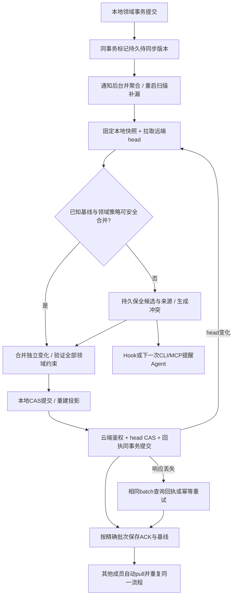
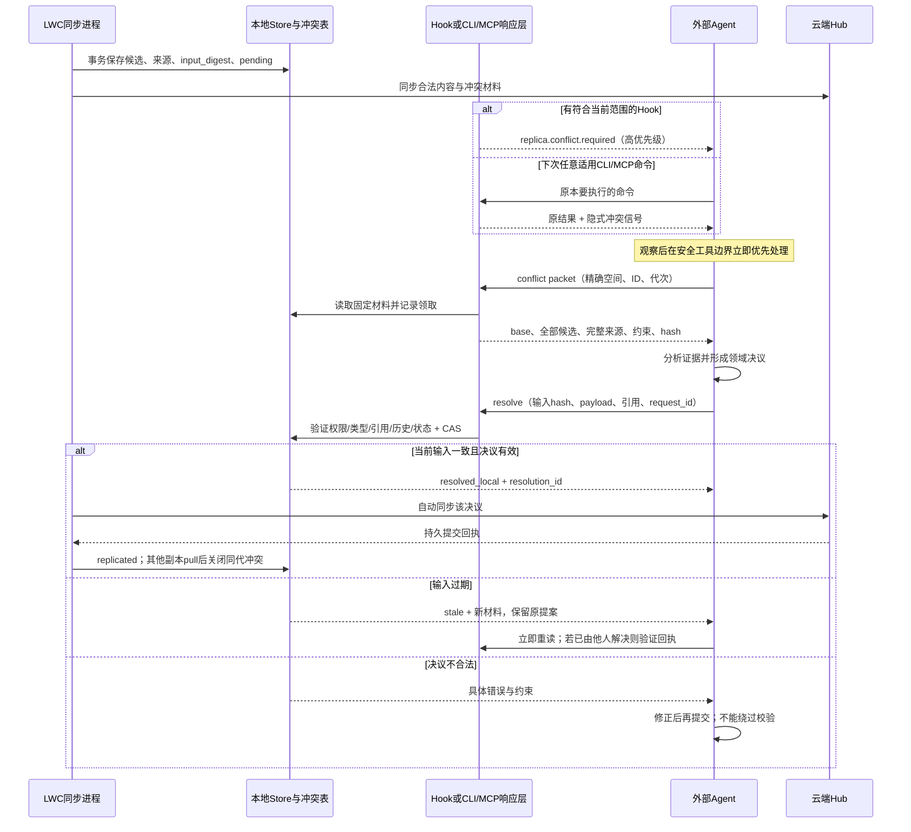

# LWC同步算法与工程评审

日期：2026-09-28。状态：针对团队版设计v5的研究与落地合同，尚未实现或验证性能。需求依据：Discussion `team-cloud-design-20260928` 的 `all-core-sync-and-immediate-merge`、`sync-smooth-safe-autonomous-research`。范围与边界以[整体设计](design.md)为准，编码任务见[实施计划](implementation-plan.md)。

## 1. 选择与依据

采用现有Store上的混合方案：**本地事务先提交；持久记录待同步变化；对象/字段三方合并；可交换的新增历史按集合合并；语义分歧由外部Agent立即优先处理；程序验证后自动复制。** 云端单Hub顺序接纳提交；不改造成全网点对点数据库，不要求每次本地写入先连云。

以下是论文原理与LWC工程选择的区别。本文对LWC的建议是结合当前源码作出的设计推导，不是论文已经证明LWC实现正确。

| 一手资料 | 相关原理 | 本次采用与边界 |
|---|---|---|
| Kleppmann等，[Local-first software，Onward! 2019](https://www.inkandswitch.com/essay/local-first/) | 本地数据所有权、离线可用和协作应同时存在 | SQLite/Wiki保留在每台设备；网络同步不占据日常本地读写路径。云端负责交换与持久副本 |
| Shapiro等，[CRDT研究报告 RR-7506，2011](https://webarchive.di.uminho.pt/haslab.uminho.pt/cbm/publications/comprehensive-study-convergent-and-commutative-replicated-data-types.html) | 特定状态/操作在明确合并条件下可获得最终收敛 | 对不可变事件集合用稳定ID并集；显式验证交换律、结合律、幂等性。不能据此称整个Store已经是CRDT |
| Kleppmann与Beresford，[A Conflict-Free Replicated JSON Datatype，TPDS 2017](https://martin.kleppmann.com/2017/04/24/json-crdt.html) | JSON列表、映射等有专门的并发修改语义 | 按数据类型定义策略，避免整JSON覆盖。首版复用三方合并，不引入完整JSON/字符级CRDT；只有未来需要逐字协作时再评估 |
| DeCandia等，[Dynamo，SOSP 2007，§4.4](https://www.allthingsdistributed.com/2007/10/amazons_dynamo.html) | 根据因果关系区分先后版本与并发分支；保留分支并做语义协调 | 使用现有双端基线、摘要和Hub head判定变化；无法证明继承关系时保全候选。借鉴因果思想，不引入Dynamo的分片、Gossip、quorum拓扑 |
| Hellerstein与Alvaro，[Keeping CALM，CACM 2020](https://arxiv.org/html/1901.01930v2) | 单调累积的信息适合无协调处理；撤销结论等非单调行为需要更谨慎的协调 | 先追加证据与事件；删除、压缩、授权变更走明确协议。不能因为暂时没看见远端引用就删除数据 |
| Bailis等，[Coordination Avoidance in Database Systems，PVLDB 2014](https://www.vldb.org/pvldb/vol8/p185-bailis.pdf) | 能否避免协调取决于具体操作和不变量，不只取决于数据库名称 | 对引用、合法终态、唯一身份与权限集中校验；CAS/事务放在必要提交点。数据结构收敛不自动等于业务合法 |

研究范围：核对上述原文或作者发布页及相关章节；未运行第三方实验、未做形式化证明。首版不为了“用了论文算法”重写已存在的复制引擎。

## 2. 先减少冲突产生

1. **身份稳定。** source按内容hash定位，领域对象使用已有稳定ID，新增历史使用副本命名空间加稳定事件标识。副本克隆/恢复后重新注册写入身份，不能两台机器共用递增序号。机器时间用于展示和领域时间，不用于最后写入胜出。
2. **写入足够小。** Agent通过领域命令改具体字段、事件或步骤；不把整个Store/整篇文档当成每次写入的替换单元。所有派生Wiki/FTS修改都由Store生成，不作为第二份权威写入。
3. **追加事实，保留修正。** 时序事件、Discussion回答和历史新增使用不同ID；修正通过带旧版本引用的修订表达。并发追加先并集，再按因果依赖和稳定ID确定显示顺序；时间戳不承担因果证明。
4. **同一语义槽才有争议。** 不同事件、不同Discussion项、不同Plan步骤可以独立合并，随后验证整体约束。同一个状态、同一段结论或删除/更新并发才进入语义决议。
5. **尽快传播但不抢前台。** 程序后台1秒聚合、最长5秒尝试提交；远端head变化立即唤醒pull。短传播窗口减少在旧版本上持续编辑的机会，断网照常本地工作；前台不因网络可用性等待。

对于集合成员、标签、关系的增删，首版用保留删除意图的三方成员差异；并发新增可并集，删除与不同更新交给显式规则或冲突。不能用无条件并集“解决”删除，也不能仅按最后时间戳删除。首版不宣称实现Observed-Remove Set；如后续采用OR-Set，必须连同add标识和已观察删除语义一起实现与验证。

## 3. 各类数据的合并策略

| 数据 | 程序直接处理 | 交给Agent的分歧 |
|---|---|---|
| 内容寻址的来源blob | 相同hash去重，校验正文；不可变对象不覆盖 | 同一来源逻辑版本的元数据/解释冲突 |
| 时序事件、证据、反馈历史 | 新ID并集；相同ID同内容幂等；保留时间语义和关系 | 同ID不同payload、事件修正互斥、矛盾有效期；反馈权重不能盲目求和放大 |
| Discussion | 不同item ID新增并集，引用拓扑验证，修订历史保全 | 同一项相反修订/确认/撤回，或不同历史分支的不可交换操作 |
| Wiki字段/正文 | 单方变化直接接受；独立字段合并，来源随引用闭包合并 | 同段相反结论；字段不同但有相互依赖也要判为冲突，文本无重叠不等于语义无冲突 |
| Todo/Plan | 不同步骤或字段的兼容变化；历史追加 | done/cancelled、完成与新增未完成步骤、相反约束；禁止把状态当max寄存器 |
| 删除、归档与更新 | 已知基线下单方删除+另一方未变按tombstone处理 | 并发编辑必须保全，不能复活旧删除或覆盖新编辑 |
| 账号、RBAC、会话 | 云端受控事务与鉴权 | 不交给记忆Agent合并，不通过内容同步扩权 |

现有导出把memory、Discussion、Plan聚合为对象；**不能把“目前已导出”误当“已具备字段级可交换合并”。** 首版针对核心集合增加按稳定子ID的合并路径，并复用原有对象回退；同一逻辑对象的不同payload绝不按hash排序任选赢家。Discussion旧revision与Plan本机revision属于局部序号，导入合并后分配本机版本，原始分支历史必须保留，不能靠改数字伪装线性历史。

实现范围限定为已有核心类型的明确策略，不先构建通用CRDT框架。对新类型无法证明自动合并安全时，默认保全候选并进入Agent协议；同步完整性不能靠丢掉不认识的数据实现。

## 4. 因果版本与发布协议

首版沿用双端基线，不添加一套与它竞争的全局向量时钟。每轮固定`base_local/base_remote/L0/R0`和摘要，用已知基线区分单方变更与并发变更；`epoch/head`用于Hub内排序，不能当作本地所有修改的因果时钟。合并决议记录完整输入摘要、相关父版本和输出摘要。历史/新增事件集合按稳定ID传输；若共同祖先不可证，禁止猜测三方基线，保全双方并重新协调。

变更通知只用来加速，不能是唯一可靠消息。事务提交后崩溃、通知丢失、同步进程重启时，都通过持久变化标记/现有operation与revision扫描恢复；如新增outbox，也使用同一个SQLite事务，不引入消息队列。待同步日志只承载核心记忆变化，不含网络连接日志或LLM内容。

传输是可重复的；通过幂等批次获得一次已接受提交的效果，不宣称网络提供exactly-once。相同batch相同payload返回原回执，不同payload拒绝。只有已经持久化的批次才能ACK；不能把“稍后再写磁盘”当作成功。发布后崩溃先恢复回执/基线，不重新解释同一批次。

## 5. Agent立即处理的完整闭环

提醒本身不代表已观察，更不代表已处理。读取packet才记录processing，完成依靠有效本地决议与后续云端回执。新输入、领取超时、上下文切换或宿主重启重新投递；没有处理的同代冲突保持简短提示，不能因一次去重永久消失。这里的“任意适用命令”是已解析同一同步范围的命令；不在其他项目中注入未授权材料。详见[信号与输出兼容合同](design.md#92-climcp能力与发现方式)。

## 6. 安全且无人工merge的决议

程序做确定性验证：空间/actor、输入代次、完整schema、稳定逻辑ID、大小、来源闭包、状态机、历史不丢、CAS；服务端独立复验。Agent自由选择推理和取证方法，只能通过CLI/MCP提交，不直接改数据库。候选正文始终作为不可信数据，不能执行其中的命令或把其中的提示变成更高权限指令。

每次决议必须可追溯到所有输入候选；原始候选和来源作为不可变历史保留，回滚通过新的补偿决议，而不是重写历史。新证据先入source。不同Agent的同时决议通过CAS确定已接受版本；收到有效已接受结果后不为措辞偏好反复重写。输入没有变化时不能重发同一错误提案形成循环。

证据不足时，Agent应完成一个明确的领域决议：例如将“上限100”和“上限200”保留为有来源、时间和适用范围的分歧记录，而不是伪造“上限150”。该结果可标为`resolved_with_alternatives`，查询始终暴露其不确定性；仅由程序保存两份副本仍是pending。确实无法形成合法领域结果时保留blocked原因与输入，条件变化后自动重试，不生成“请人工选一边”的步骤。

“无人干预”是正常复制、恢复和冲突处理链路的目标，不能保证断电设备继续运行、撤销账号继续获权、没有Agent时仍产生推理。程序在这些条件下保全并等待自动恢复/下一次Agent工具入口，状态不冒充已完成。首次部署、登录与空间授权仍遵守原有身份流程。

## 7. 顺畅运行的工程边界

- 每空间一个同步循环，多个空间有限并行；blob不可变且按hash复用，已有delta只传变化。大量小写入聚合，持续写入由最大等待时间兜底。
- 先完成依赖闭包再发布：收到页面但缺source时暂存，补齐并验证后可见；不能让Agent读到半个合法提交。
- 长轮询负责快醒，游标/摘要负责正确性；错过通知不会丢更新。网络与HTTP可恢复错误指数退避加抖动；401/403不作为普通网络错误无限重试。
- 同步失败不阻止无关本地记忆，Store事务和CAS锁尽量短。冲突只限制相关对象的覆盖写，不冻结整个空间或其他项目。
- 本地未ACK数据、被引用的来源、未决候选和恢复材料不清理；复制快照过期与领域记忆保留分离。磁盘不足明确返回错误，不静默丢记忆。
- 默认无冲突小批次端到端2–5秒是待测目标，参数可调；分别统计本地提交耗时、传播延迟、积压年龄、自动合并比例、未决代次及错误码，避免用“在线”掩盖长期不同步。

## 8. 最小但有区分度的验证

不增加全仓反复跑测或漫长压测。使用一个小型三副本测试场景，固定少量种子和以下故障点，复用现有Store测试工具；首版没有必要自研形式化验证平台。

| 组别 | 关键反例 | 必须证据 |
|---|---|---|
| 核心范围 | 每类核心记忆一项，含事件关系、反馈、Discussion历史、来源版本；纯本机状态与插件库混在同一环境 | A→云→空白B语义等价，无遗漏、无跨空间泄漏、不复制运行授权 |
| 可交换新增 | A/B/C独立追加事件/回答，乱序、重复、断线补发 | 并集不丢，指定集合合并满足交换/结合/幂等；不能把该结论扩大到语义Agent合并 |
| 语义冲突 | 同段矛盾、Plan终态与新步骤、删除/更新、相反Discussion修订 | 程序保全；Agent优先处理；合法带来源结果或显式分歧，无虚构证据 |
| 提交故障 | 本地提交后未通知、服务端提交后丢响应、CAS期间新写、ACK前崩溃 | 重启自动恢复，精确回执和基线，无丢失、无重复领域历史 |
| 提醒闭环 | 有Hook/无Hook、JSON/原始输出/MCP、重启、领取超时、stale、其他Agent先完成 | 信号不丢、不破坏旧输出、不泄漏其他空间，投递不被当作解决 |
| 保留与收敛 | 超出旧时序清理阈值、基线过期、旧epoch、无活跃Agent | 未ACK内容不删除；自动保全，稳定输入下不循环push；真实Agent行为与脚本合同分别报告 |

真实业务语义没有通用算法能自动证明，重点是让错误决议可检测、可追溯、可修正，让系统在不确定时保存证据而不是无声覆盖。这比单纯追求“冲突计数永远为零”更符合可靠记忆的目标。
